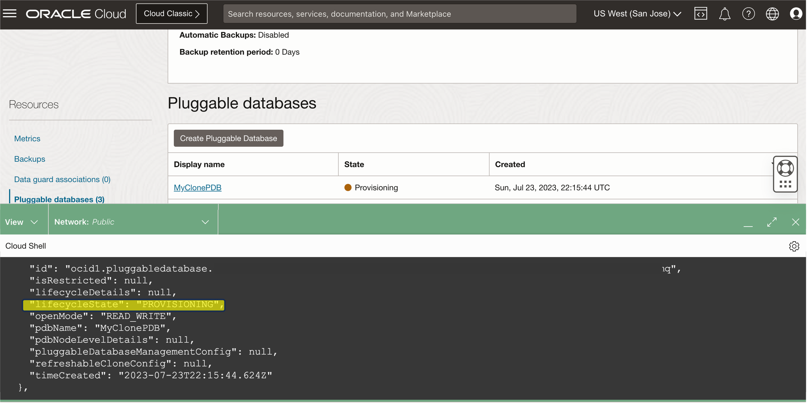

# Discover Environment Details using REST API


## Introduction

Any operation that you can do with the web console, you can also do with a corresponding REST API. Similar to the web console, the REST APIs transit the Internet via https, and require no special software to be installed on the local system. The Oracle Cloud Infrastructure APIs are typical REST APIs that use HTTPS requests and responses.

This lab walks you through the steps to discover Exadata Database Service on Cloud@Customer environment details using REST API.

Estimated Lab Time: 10 minutes

### Objectives

-   After completing this lab, you should be able to discover Exadata Database Service on Cloud@Customer environment details using REST API.


### Prerequisites

This lab requires completion of the following:

* Completion of **Lab3**

## Task 1: List all the Pluggable Databases in a Container Database using REST API

1. Open the Cloud Shell. This displays the Cloud Shell at the bottom of the console:

   

2. Make OCI REST API call to get a list of the Pluggable Databases in a Container Database by running the **OCI RAW-REQUEST** Command below:
   
   *Note*: Replace the **"{ContainerDatabaseOCID}"** with the **Container Database OCID**
   
    ```
      <copy>

        oci raw-request --http-method GET --target-uri "https://database.us-sanjose-1.oraclecloud.com/20160918/pluggableDatabases?databaseId={ContainerDatabaseOCID}&limit=10"

      </copy>
    ```
    
     

3. You will see a similar output as below, Having a Response *"status": "200 OK"* means the request was successfully received and was able to get a list of all the pluggable databases in the specified container database. 
   
4. Copy the **PDB OCID** value from the **"id"** field and paste it in your notepad or text editor. 

    

    
## Task 2: Clone and start a pluggable database (PDB) in the same database (CDB) using REST API

1. From the Cloud Shell terminal, create the json file for the REST API request body that contains the local clone pluggable database details resource.

   For this lab, the json file is pre-created and you can view the details of the local clone pluggable database details by reading the json file.
   
    ```
      <copy>

        cat clonepdb.json

      </copy>
      ```
    

2. Make an OCI REST API call to clone and start a pluggable database (PDB) in the same container database (CDB) by running the **OCI RAW-REQUEST** command below:
   
   *Note*: Replace the **"{pluggableDatabaseID}"** with the **Pluggable Database OCID** obtained from *(Task1 Step 4)*
   
    ```
    <copy>

      oci raw-request --http-method POST --target-uri "https://database.us-sanjose-1.oraclecloud.com/20160918/pluggableDatabases/{pluggableDatabaseID}/actions/localClone" --request-body file://clonepdb.json

    </copy>

    ```

   
   
3. You will see a similar output as below, you will see that the local clone pluggable database is on a lifecycle state of **PROVISIONING**

  


## Task 3: Discover Exadata VM Cluster Details using REST API

1. Open the Cloud Shell. This displays the Cloud Shell at the bottom of the console.

   

2. Make OCI REST API call to get Exadata VM Cluster details by running the **OCI RAW-REQUEST** command below. 
   
   *Note*: Replace the **"{VMClusterOCID}"** with the **VM Cluster OCID** *copied from Lab 3 Task 1 step 2*


    ```
    <copy>

      oci raw-request --http-method GET --target-uri "https://database.us-sanjose-1.oraclecloud.com/20160918/vmClusters/{VMClusterOCID}"

    </copy>
    ```
    

    You will see a similar output as below, pay attention to the **cpusEnabled** field

    ```
    <copy>
    {
  "data": {
    "availabilityDomain": "cuGa:US-SANJOSE-1-AD-1",
    "compartmentId": "ocid1.compartment.oc1.....",
    "cpusEnabled": 6,
    "dataCollectionOptions": {
      "isDiagnosticsEventsEnabled": true,
      "isHealthMonitoringEnabled": true,
      "isIncidentLogsEnabled": true
    },
    
  "status": "200 OK"
}
  </copy>
    ```


## Task 4: List the Maintenance Updates that can be applied to the specified VM Cluster using REST API

1. Make OCI REST API call to list maintenance updates that can be applied to the specified VM Cluster by running the **OCI RAW-REQUEST** Command below.
   
   *Note*: Replace the **"{VMClusterOCID}"** with the **VM Cluster OCID** *copied from Lab 3 Task 1 step 2*


    ```
    <copy>

      oci raw-request --http-method GET --target-uri "https://database.us-sanjose-1.oraclecloud.com/20160918/vmClusters/{VMClusterOCID}/updates"

    </copy>
    ```
    

    

    You will see a similar output as below. Having a Response *"status": "200 OK"* means the request was successfully received and was able to get a list of all the maintenance updates that can be applied to the specified VM Cluster using REST API

    ```
    <copy>

    {
  "data": [
    {
      "availableActions": [
        "ROLLING_APPLY",
        "PRECHECK"
      ],
      "description": "Virtual Machine OS Update 22.1.11.0.0.230516",
      "id": "ocid1.dbupdate.oc1.us-sanjose-1....",
      "lastAction": null,
      "lifecycleDetails": null,
      "lifecycleState": "AVAILABLE",
      "timeReleased": "2023-06-06T19:15:24.842Z",
      "updateType": "OS_UPDATE",
      "version": "22.1.11.0.0.230516"
    },
    {
      "availableActions": [
        "ROLLING_APPLY",
        "PRECHECK"
      ],
      "description": "Virtual Machine OS Update 22.1.10.0.0.230511",
      "id": "ocid1.dbupdate.oc1.us-sanjose-1......",
      "lastAction": null,
      "lifecycleDetails": null,
      "lifecycleState": "AVAILABLE",
      "timeReleased": "2023-05-23T19:20:54.561Z",
      "updateType": "OS_UPDATE",
      "version": "22.1.10.0.0.230511"
    }
  ],
  "headers": {
    
  },
  "status": "200 OK"
}

    ```
    </copy>

You may now **proceed to the next lab**

## Acknowledgements

* **Author** - Leo Alvarado, Eddie Ambler, Product Management

* **Contributors** - Tammy Bednar, Product Management

* **Last Updated By** - Leo Alvarado, Product Management, July 2023.
