# Use OCI Resource Manager to generate and deploy Terraform for Application and Database Stack


## Introduction

This lab walks you through the steps to generate and deploy Terraform for Application and Database stack using OCI Resource Manage.

Estimated Time: 20 minutes


### Objectives

-   After completing this lab, you should be able to generate and deploy Terraform for Application and Database stack using OCI Resource Manager.


### Prerequisites

This lab requires the completion of the following:

* Completion of **Lab4**

## Task 1: Generate Terraform baseline configuration for Database development environment using OCI Resource Manager

1. Open the navigation menu and click **Developer Services**. Under **Resource Manager**, click **Stacks**.
   
   

2. On the **Stacks** page, select your assigned compartment.

3. Click **Create stack**.

4. On the **Create stack** page, under **Choose the origin of the Terraform configuration**, select **Existing compartment**.

5. Select your assigned **compartment** and assigned **region** containing the Exadata Database Service on Cloud@Customer Resource Model.

    

   This will create a stack that captures resources from the selected assigned compartment using **OCI Resource Manager (resource discovery)**

6. Select the service types that you want to be discovered for your terraform script by: Selecting **Selected** for the Terraform provider services and then selecting **database** for the services value. 
   
    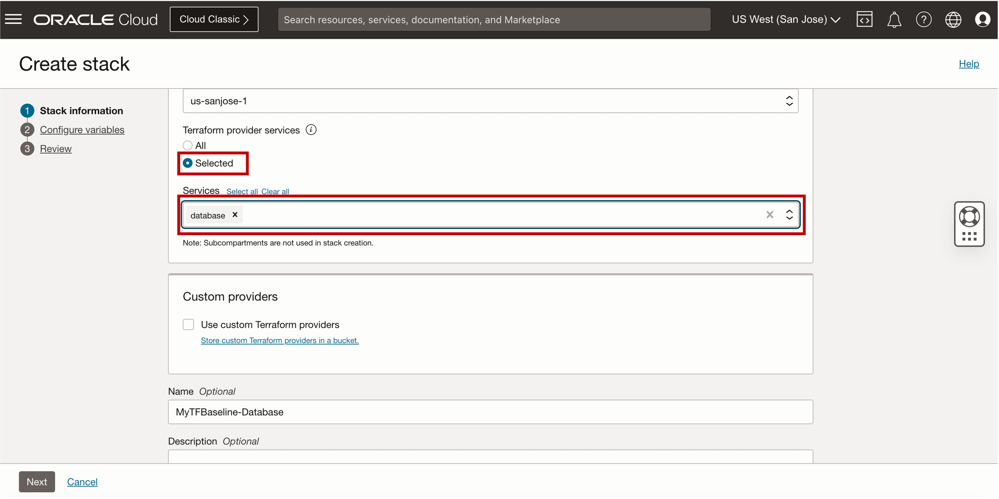
   
7. Provide the **Name** for your stack and Select the **compartment** where you want to create the stack.
   
    >**Note:** For this lab, use **MyTFBaseline-Database** for the name of your discovered database stack and use your assigned compartment for the **Create in compartment**

    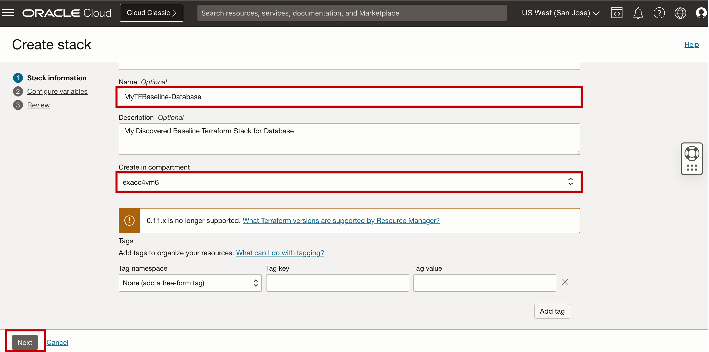

    

8. Click **Next** twice. No variables are listed for the Existing compartment stack origin because no Terraform configuration exists yet.

9.  In the Review panel, verify the stack configuration. Take note of the Terraform version for future use on your stack deployment.

    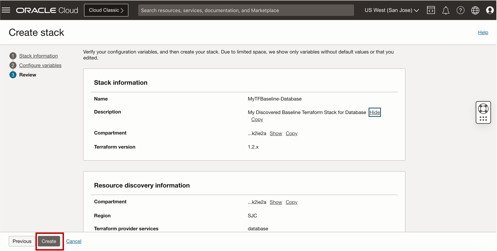

10. Click **Create**.
    
    

11. Once the newly created stack is available, Download a copy of the generated Terraform script by clicking on the **Download** link next to **Terraform configuration**.

    

    After downloading the zip file, you can unzip the file and view the generated Terraform configuration file in your text or code editor. 

    View the *database.tf* file. 

    >**Note:** Your database's generated baseline terraform code is similar to the output below. *Resources discovered in the Baseline Terraform configuration will be presented and discussed by the speakers*. Notes are added on each section of the discovered Exadata Database Service Resource Model

    This is the discovered resource for the **Custom Database Software image**

     ```
    <copy>

    ## This configuration was generated by terraform-provider-oci
    

        ## This is the discovered resource for the Custom Database Software image

        resource oci_database_database_software_image export_MyCustomDBSW {
        compartment_id = var.compartment_ocid
        database_software_image_one_off_patches = [
            "29780459",
            "30310195",
        ]
        database_version = "19.0.0.0"
        defined_tags = {
        }
        display_name = "MyCustomDBSW"
        freeform_tags = {
        }
        image_shape_family = "EXACC_SHAPE"
        image_type         = "DATABASE_IMAGE"
        patch_set = "19.11.0.0"
        }

    </copy>
    ```

    This is the discovered resource for the **Exadata VM Cluster Resource**


    ```
    <copy>


        ## This is the discovered resource for the Exadata VM Cluster Resource

        resource oci_database_vm_cluster export_ecc4c4 {
        compartment_id = var.compartment_ocid
        cpu_core_count = "0"
        data_collection_options {
            is_diagnostics_events_enabled = "true"
            is_health_monitoring_enabled  = "true"
            is_incident_logs_enabled      = "true"
        }
        data_storage_size_in_tbs    = "30"
        db_node_storage_size_in_gbs = "120"
        db_servers = [
            "ocid1.dbserver.oc1.us-sanjose-1.aaaaaaaaaaaaa",
            "ocid1.dbserver.oc1.us-sanjose-1.aaaaaaaaaaaaa",
        ]
        defined_tags = {
        }
        display_name              = "ecc4c4"
        exadata_infrastructure_id = "ocid1.exadatainfrastructure.oc1.us-sanjose-1.a"
        freeform_tags = {
        }
        gi_version                  = "19.19.0.0.0"
        is_local_backup_enabled     = "false"
        is_sparse_diskgroup_enabled = "true"
        license_model               = "BRING_YOUR_OWN_LICENSE"
        memory_size_in_gbs          = "60"
        ssh_public_keys = [
        ]
        time_zone             = "UTC"
        vm_cluster_network_id = "ocid1.vmclusternetwork.oc1.us-sanjose-1.aaaaaaaa"
        }
    
    </copy>
    ```

    This is the discovered resource for the **Database Home**

    ```
    <copy>

        ## This is the discovered resource for the Database Home

        resource oci_database_db_home export_MyDBHome {
        db_version = "19.13.0.0.0"
        defined_tags = {
        }
        display_name = "MyDBHome"
        freeform_tags = {
        }
        source        = "NONE"
        vm_cluster_id = oci_database_vm_cluster.export_ecc4c4.id
        }
    
    </copy>
    ```
    This is the discovered resource for the **Container Database**

    ```
    <copy>


        ## This is the discovered resource for the Container Database

        resource oci_database_database export_MyDBHome_database {
        database {
            admin_password = "<placeholder for database admin password>" 
            character_set = "AL32UTF8"
            db_name        = "MyExaDB"
            db_unique_name = "exadb19"
            db_workload    = "OLTP"
            defined_tags = {
            }
            freeform_tags = {
            }
            ncharacter_set = "AL16UTF16"
            pdb_name       = "mypdb"
            sid_prefix     = "myexadbcc"
        }
        db_home_id = oci_database_db_home.export_MyDBHome.id
        source = "NONE" #Required attribute 
        lifecycle {
            ignore_changes = [source, database[0].admin_password]
        }
        }
    
    </copy>
    ```

    This is the discovered resource for the **Pluggable Databases**

    ```
    <copy>


        ## This is the discovered resource for the Pluggable Databases

        resource oci_database_pluggable_database export_pluggable_database {
        container_database_id = oci_database_database.export_MyDBHome_database.id
        defined_tags = {
        }
        freeform_tags = {
        }
        #pdb_admin_password = 
        pdb_name = "MYPDB"
        }

        resource oci_database_pluggable_database export_pluggable_database_1 {
        container_database_id = oci_database_database.export_MyDBHome_database.id
        defined_tags = {
        }
        freeform_tags = {
        }
        #pdb_admin_password = 
        pdb_name = "MYCLONEPDB"
        }

    </copy>
    ```

## Task 2: Deploy Gold Image Stack (Database and MyDesktop Application) using OCI Resource Manager and Terraform

1. In the Breadcrumb link, Click on **Stacks** then select your assigned **compartment** and Click **Create stack**.

    

2. On the **Create stack** page, under Choose the origin of the Terraform configuration, select **My configuration**.

   Select **.Zip file** for the Terraform configuration source. then browse your desktop for a file called ***SampleTF.zip***. 
   
   
    


3. Provide the **Name** for your stack and select the **compartment** where you want to create the stack.

    >**Note:** For this lab, use ***MyAppDBStack*** for the name of your discovered database stack and use your assigned compartment for the **Create in compartment**

4. For Terraform version, select the *version 1.2.x*.
   
   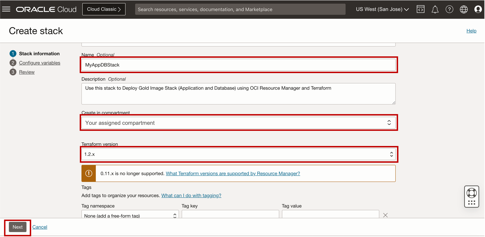

5. Click **Next**. In the **Configure variables panel**, review and provide the required variables listed from the Terraform configuration.

    Provide required variable details for the **Application Server Stack**.
   
   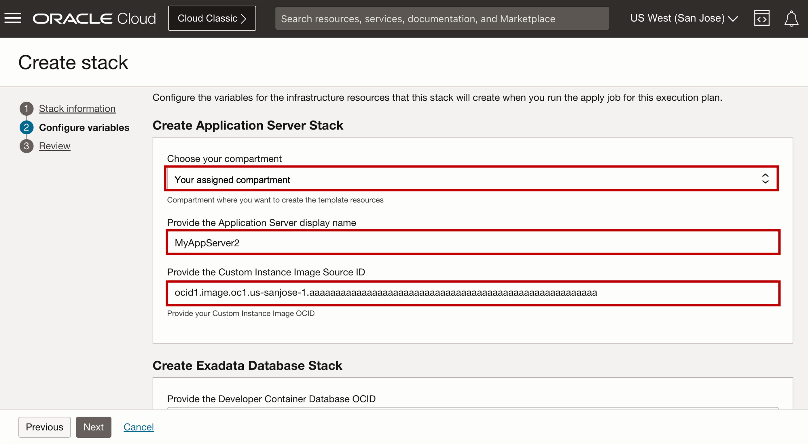

      * Choose your **assigned compartment**
      * Provide the **Application Server display name**. For this lab, use the name ***MyAppServer***
      * Provide the **Custom Instance Image Source ID**
    
    Provide required variable details for the **Exadata Database Server Stack**.
   
   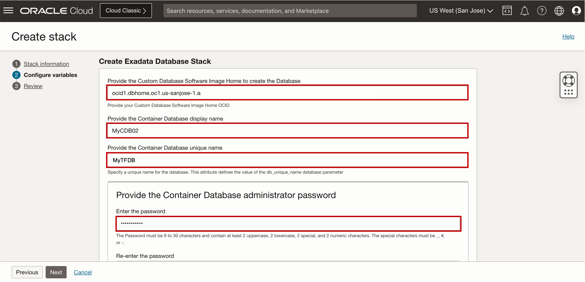

      * Provide the **Custom Database Software Image Home OCID**
      * Provide the **Container Database display name**. For this lab, use the name ***MyCDB02***
      * Provide the **Container Database unique name**. For this lab, use the name ***MyTFDB***
      * Provide the **Containder Database administrator password**
   
   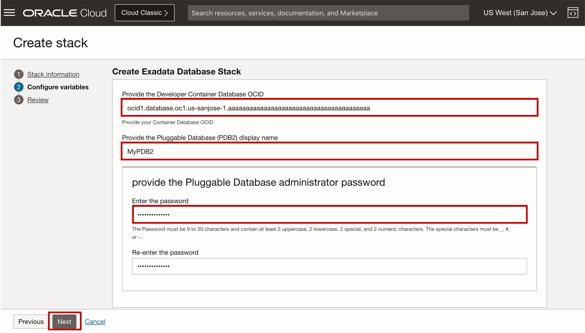

      * Provide the **Pluggable Database (PDB1) display name**. For this lab, use the name  ***MyPDB1***
      * Provide the **Pluggable Database (PDB2) display name**. For this lab, use the name  ***MyPDB2***
      * Provide the **Pluggable Database (PDB3) display name**. For this lab, use the name  ***MyPDB3***
      * Provide the **Pluggable Database administrator password**
  
    Click on **Next**

6. In the **Review** panel, verify the stack configuration and Click **Create** to establish your customized stack.
   
   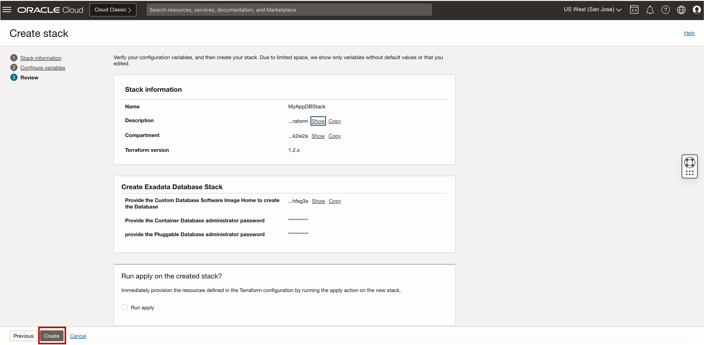

    >**Note:** Now that we have a defined stack, let's prepare to use the stack to deploy a new developer environment consisting of an Application Server and 1 Exadata Container Database and 3 Pluggable Databases. 

    
    
7. Create Stack Deployment Plan by: Clicking on **Plan** on the Stack details page. 
   
    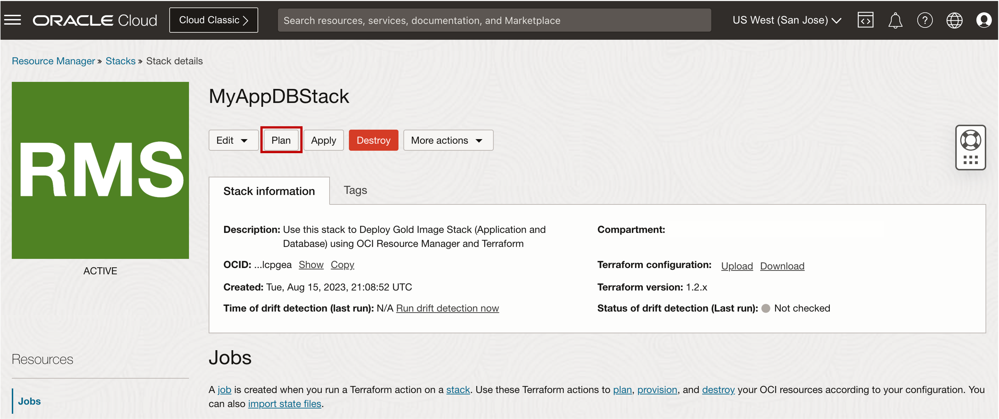

   In the Plan panel, use ***MyAppDBStackPlan*** for the Plan name and then Click on **Plan** to proceed. 

    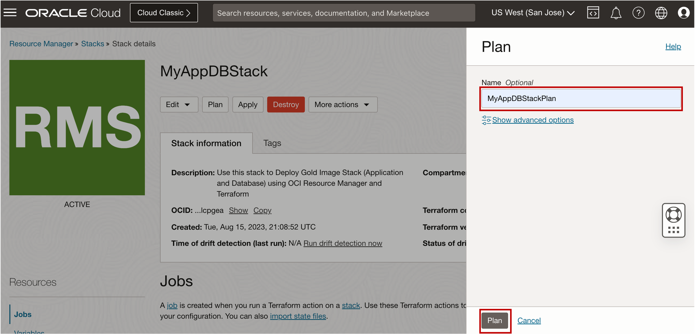
   
    >**Note:** The plan job is created and is listed under Jobs. 

    When the Stack Deployment Plan process completes, the state of the plan job changes to **Succeeded**.

    
   
    
8.  In the **Breadcrumb** link, Click on **Stack details**.  

    

    Process Stack Deployment Plan by clicking on **Apply**.

    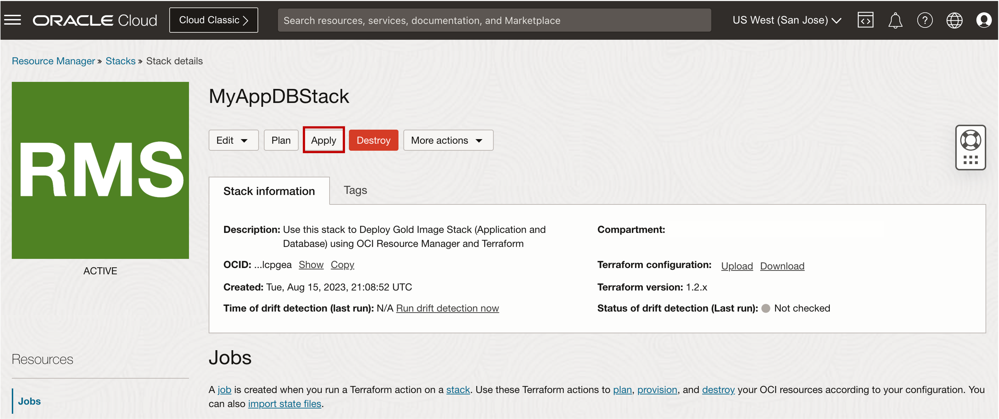
    
    In the Apply panel, edit the default name for the job. For this lab, we will use ***MyAppDBStackApply*** for the Apply name. 

    Select **Automatically Approve** for the Apply job plan resolution and then Click on **Apply**. 

    
    
    >**Note:** This will cause the apply job to be created and our new Application and Database stack to be deployed once the job completes.

    
    

<!--
## Learn More

* Click [here](https://docs.public.oneportal.content.oci.oraclecloud.com/en-us/iaas/exadata/doc/ecc-create-first-db.html) to learn more about Creating an Oracle Database on Exadata Database Service.

-->

## Acknowledgements

* **Author** - Leo Alvarado, Eddie Ambler, Product Management

* **Contributors** - Tammy Bednar, Product Management

* **Last Updated By** - Leo Alvarado, Product Management, July 2023.
