# Provision Oracle Exadata Database Service on Exascale Infrastructure on Oracle Database@Azure

## Introduction

This lab walks you through how to create an instance of the Oracle Exadata Database Service on Exascale Infrastructure on Oracle Database@Azure using the Azure Portal. 
 

**Estimated Time:** ***2 Hours 10 minutes***

### Objectives

-   After completing this lab, you should be able to create an Exadata VM cluster and an Oracle Database on Oracle Exadata Database Service on Exascale Infrastructure using the OCI Console.

### Prerequisites

* An existing Microsoft Azure subscription.

* A Microsoft Azure Resorce Group created.

* A Microsoft Azure Virtual Network (VNet) with a subnet delegated to the Oracle Database@Azure service.

* Permissions in Microsoft Azure to create resources in the region.

* Oracle Cloud Infrastructure (OCI) Service Limits approved in the region you want to provision Oracle Exadata Database Service.

## Task 1: Create an Exadata VM Cluster Resource on Oracle Exadata Database Service on Exascale Infrastructure on Oracle Database@Azure  

1. Log in to the Microsoft Azure portal, navigate to the left pane to display a list of services and click **Oracle Database@Azure**.

   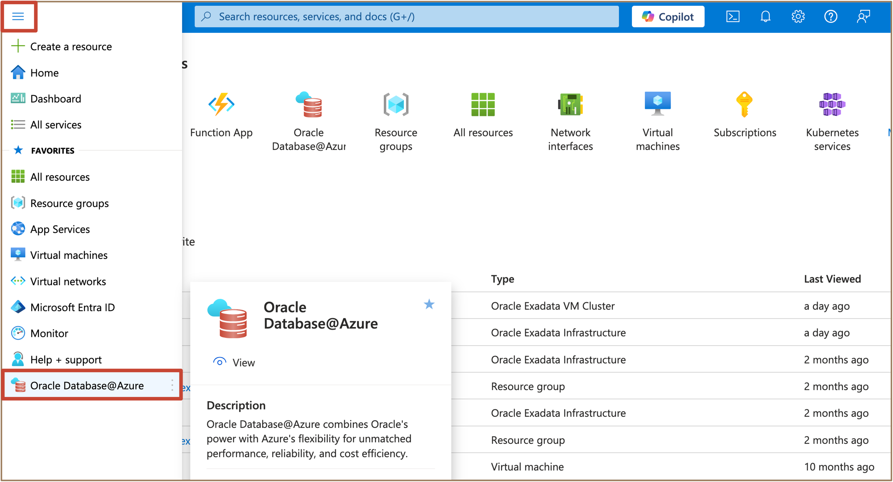

2. Provision the Oracle Exadata Database Service on Exascale Infrastructure resources from Oracle Database@Azure.

   Click **Oracle Database@Azure** drop-down menu and then **Oracle Exadata Database Service on Exascale Infrastructure**.

   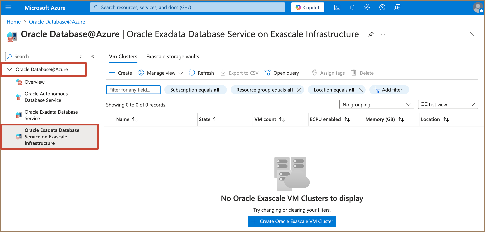

3. Click **Vm Clusters** and select **+ Create** to begin the provisioning flow.

   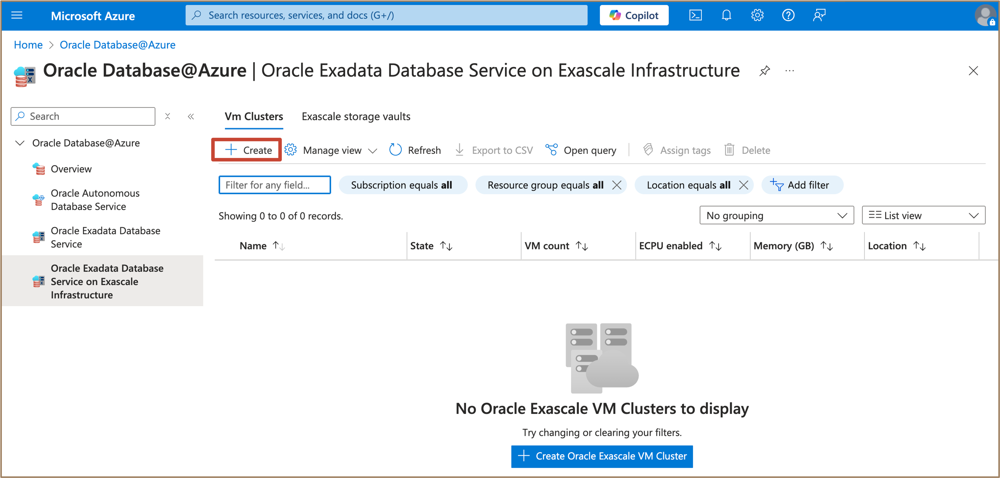

4. In the **Basics** section, enter the following information and click **Next**.
      
      * **Project details:**
        * **Subscription:** Select the Microsoft Azure subscription for the Exascale VM cluster.
        * **Resource group:** Select an existing resource group or click **Create new** to create and use a new resource group for this resource.
      * **Exascale VM Cluster details:**
        * **Name:** Enter the name for the Exascale VM cluster.
        * **Region:** Select the region where the Exascale VM cluster will be provisioned.
        * **Availability zone:** Select an availability zone.
        * **Cluster name:** Enter a cluster name.
        * **License type:** The type of license you want to use for the VM cluster. The license type is either ***License included*** or ***Bring your own license (BYOL)***. Your selection will affect your billing.
        * **Time zone:** The default time zone is UTC. There is also an option to select another time zone.
        * **Oracle grid infrastructure release:** Select the Oracle Grid Infrastructure release.
        * **Oracle grid infrastructure version:** Select the Oracle Grid Infrastructure version.
  
  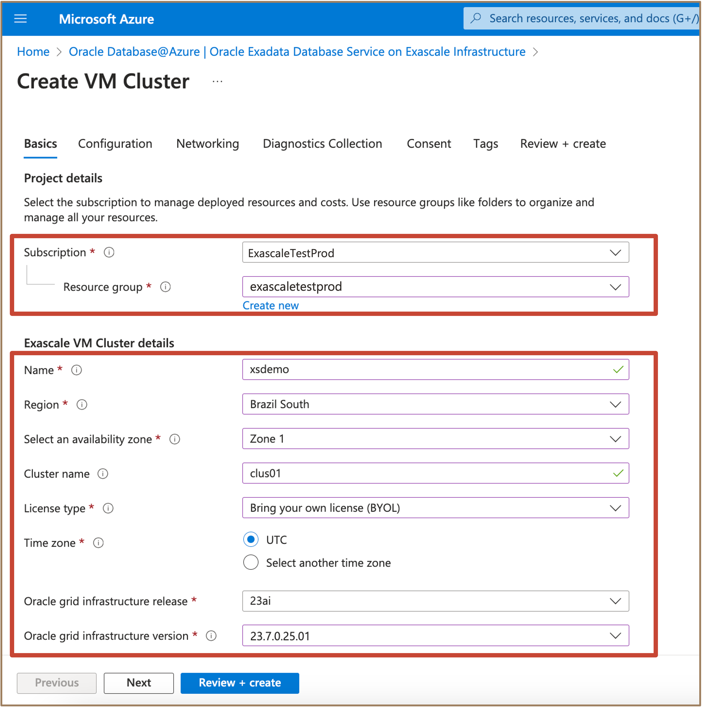
   
      * **Exascale Database Storage Vault:**
        * **Choose:** Select either ***Create new vault*** or ***Select existing vault***. If you select an existing vault, then select the database storage vault from the drop-down menu.
        * **Vault name:** Enter the vault name for the new Exascale vault.
        * **Storage capacity for Databases:** The amount of usable disk storage capacity that will be available for storing databases that is desired. Specify the size in gigabytes (GB).
        * ***(Optional)*** **Add smart flash and memory cache options:** Enter the amount of smart flash cache. It is based on a percentage of storage capacity.
        * **Security:** The SSH public key source can be selected to ***Generate new key pair***, ***Use existing key stored in Azure***, or ***Use existing public key***.
          * If you select ***Generate new key pair***, you must give your newly generated key a unique name.
          * If you select ***Use existing key stored in Azure***, you must select that key from a drop-down menu of defined key for your subscription.
          * If you select ***Use existing public key***, you must provide an RSA public key in single-line format (starting with `ssh-rsa`) or the multi-line PEM format. You can generate SSH keys using `ssh-keygen` or Linux and OS X, or PuTTYGen on Windows.  

  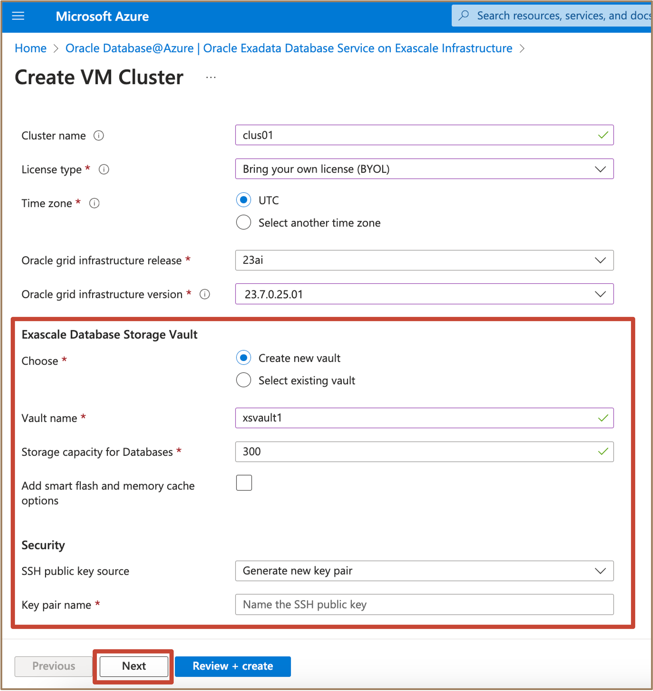

5. In the **Configuration** section, enter the following information and click **Next**.
    * In **VM Cluster allocation**, select resources for the VM cluster.
        * **Number of VMs in the cluster:** Specify the number of the VMs that you want to configure for the cluster, between 2 and 10.
        * **ECPUs enabled per VM:** Specify the number of ECPU cores that you want to enable for the VM cluster. The minimum is 8 ECPU. The value you select must be a multiple of 4.
    * ***(Optional)*** Add reserve additional ECPU**
        * **ECPUs additional reserved per VM:** _(read-only)_ Indicates the additional reserved ECPUs
        * **Total additional ECPUs reserved across VM Cluster:** _(read-only)_.
        * **Total ECPUs per VM:** Enter the total number of ECPUs to allocate per VM. The total must be between 8 and 200.
        * **Total ECPUs enabled across VM Cluster:** _(read-only)_.
    * **Memory per VM (GB):** _(read-only)_ Displays the amount of memory allocated to each VM. Memory is calculated based on 2.75 GB per ECPU.
    * **Total memory across VM cluster (GB):** _(read-only)_ The total memory across VM cluster (GB) field is automatically updated to provide you with the total amount of memory allocated across the VM cluster.
         
  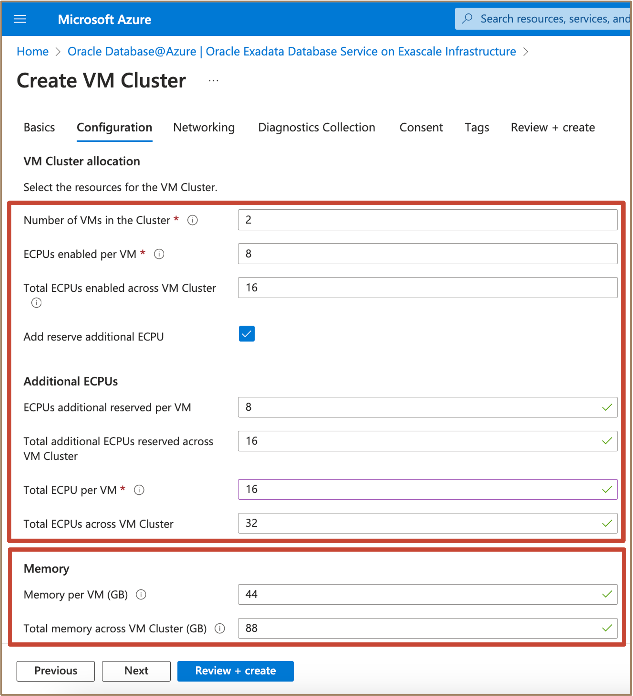
    * **VM file system storage capacity per VM (GB):** Specify storage capacity per VM in gigabytes (GB).
      > **Note:** Enter how much storage you want for the VM filesystem. The VM filesystem storage includes `/u02` capacity, where your database homes will be created, along with all the other VM file systems. The extra capacity selected beyond system minimum will expand `/u02` file system.

      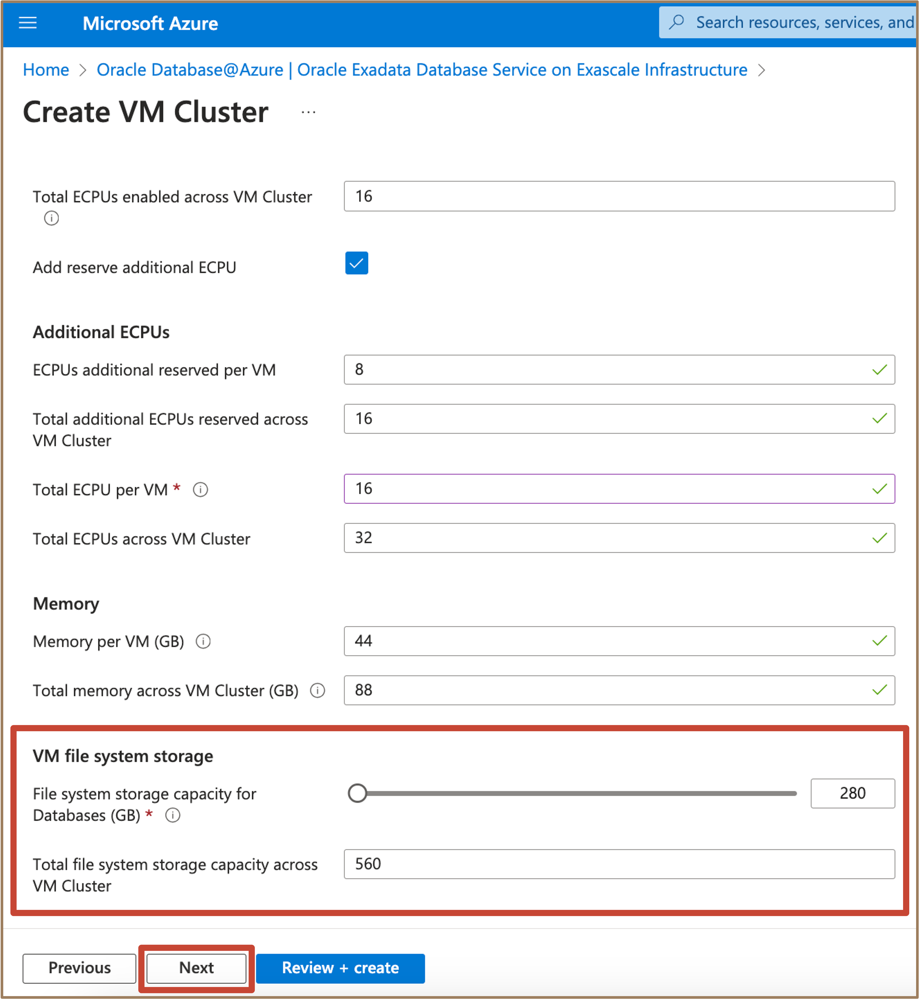

6. In the **Networking** section, enter the following information to configure the network settings and click **Next**.
     * **Virtual network:** Select the virtual network (VNet) in which you want to create the VM cluster.
  
      > **Note:** The drop-down menu will only list virtual networks that are located within the subscription and resource group that you have selected in the **Basics** section. If the drop-down menu is empty, you may need to specify a different subscription or resource group, or create a virtual network within the selected resource group.
     
     * **Client subnet:** Select the client subnet.
      
      > **Note:** The drop-down menu will only list delegated subnets that are contained within the virtual network that you have selected above. If the drop-down menu is empty, you may need to specify a different virtual network, or create a delegated subnet within the selected virtual network.
   
     * **Backup subnet:** Leave this field blank as Oracle will automatically assign it. This is the subnet to use for the backup network, which is typically used to transport backup information to and from the backup destination, and for Oracle Data Guard replication.
   
     * **Hostname prefix:** Enter a hostname. The prefix forms the first portion of the Exadata VM cluster host name. Recommended maximum: 12 characters.
   
     * **Host Domain Name:** _(read only)_ Displays the host domain name for the VM cluster.
   
     * **Host and domain URL:** _(read only)_ This read-only field combines the host and domain names to display the fully qualified domain name (FQDN) for the database.
      
      > **Note:** If custom DNS is selected, this field is composed of the entered hostname and selected private zone. If custom DNS is not selected, this field is composed of the entered hostname, selected subnet, and selected virtual network.
   
     * **SCAN Listener Port (TCP/IP):** Assign a SCAN listener port (TCP/IP) in the range between `1024` and `8999`. The default is `1521`. If you do not assign the port, then the Exadata VM cluster is created with the default port.
   
     * **Add additional network ingress rules:** Add additional network CIDR ranges (such as application or hub subnet ranges) to the Network Security Group (NSG) ingress rules for this VM cluster. The selected virtual network's CIDR is added by default.

  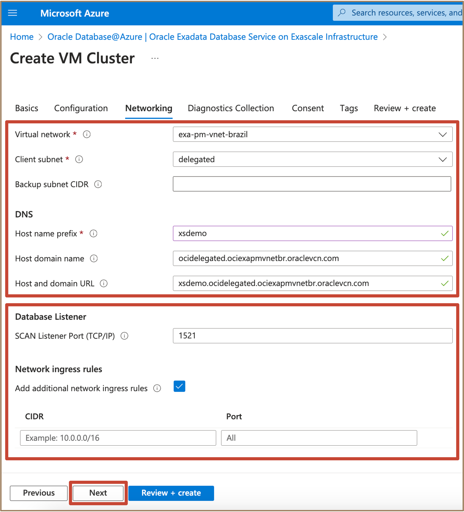

7. In the **Diagnostics Collection** section, select all to enable diagnostics collection and click **Next**.

  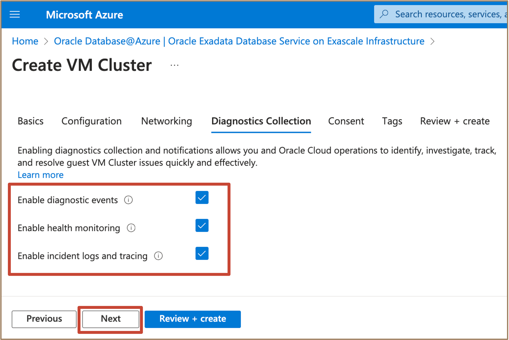

    > **Note:** Enabling diagnostics collection and notifications allow you and OCI operations to identify, investigate, track, and resolve guest VM issues quickly and effectively.

8.  In the **Consent** section, you must agree to the **terms of service**, **privacy policy**, and agree to **access permissions**. Select **Next** to continue.

   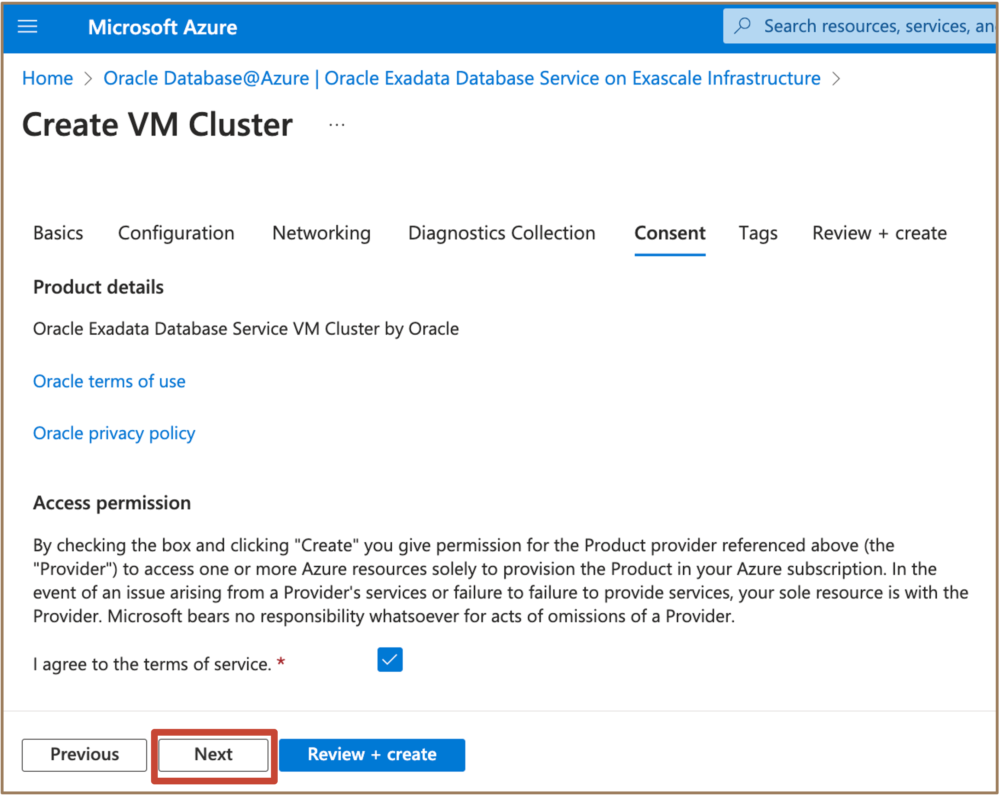

9.  In the **Tags** section, you can define Microsoft Azure tags and click **Next**.

   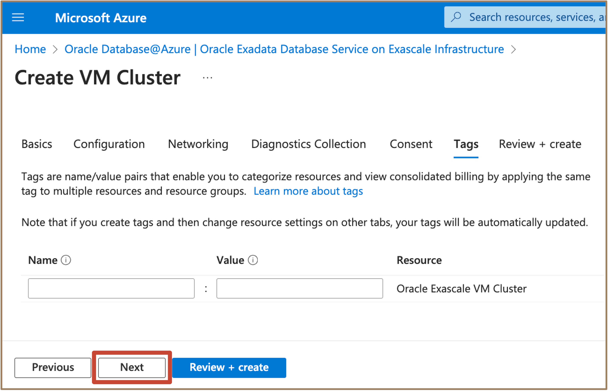

10. In the **Review + create** section, a short validation process is run to check the values that you entered from the previous steps. If the validation fails, you must correct any errors before you can start the provisioning process.

    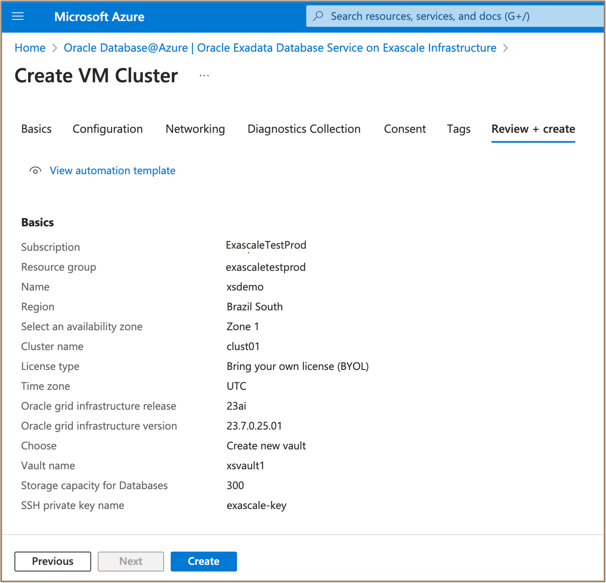

11. Click **Create** to start the provisioning flow.

    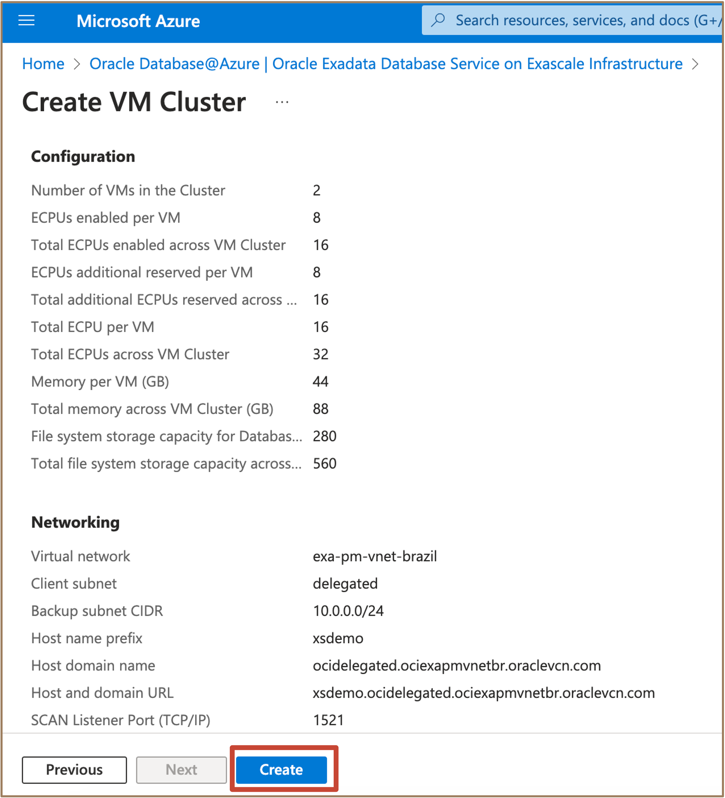

    Once the provisioning process is completed. Deployment status of both Oracle Exascale VM Cluster and Oracle Exascale DB Storage Vault will show as **OK**.   

    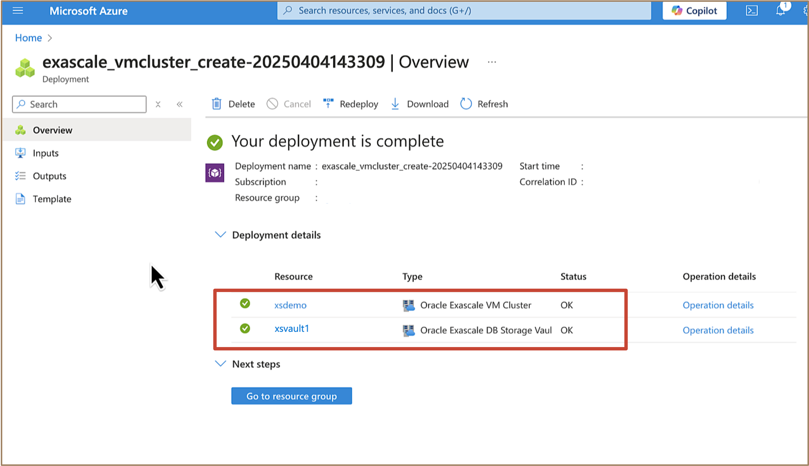 

## Task 2: Discover the Oracle Exascale VM Cluster Details

1. In the **Oracle Exadata Database Service on Exascale Infrastructure** page, select the **Vm Clusters** tab. 
   
   Once the provisioning process of the **Oracle Exascale VM Cluster** is completed, the state of the VM cluster will show as ***Available***.

    

2.  Click the created VM cluster to view the details of the Oracle Exascale VM cluster.

    

    On the **Oracle Exascale VM Cluster** **Overview** page ***Discover the available VM Cluster information:***
        
    * In the **Essentials** Section you can find the following key items:
        * What Resource group the Oracle Exascale VM Cluster is in.
        * The Location of the Oracle Exascale VM Cluster.
        * The Subscription where the Oracle Exascale VM Cluster is deployed.
        * The Subscription ID.
        * Assigned tags for the VM Cluster 
        * The State of the VM Cluster
        * A link to view the OCI Database URL
        * A link to view the Storage Vault 
    
    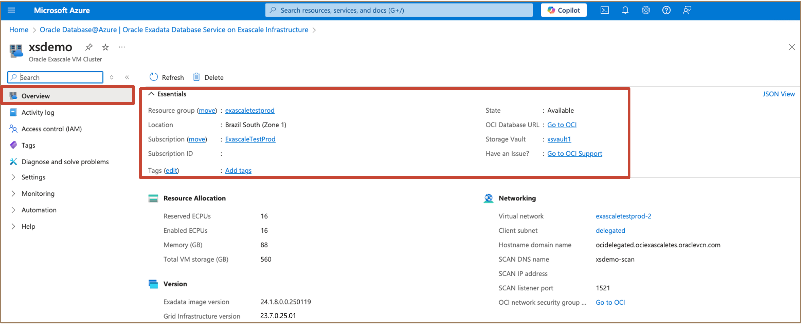 

    * The **Resource Allocation** Section contains the following Cluster Wide Metrics:
        * The number of Reserved ECPUs available to conduct online scale up operation.
        * The number of Enabled ECPUs across the VM Cluster.
        * The amount of Memory allocated to the VMs across the VM Cluster.
        * The total VM File System Storage allocated to the VMs across the VM Cluster.
    * In the **Version** Section of the page, you will find the following key items:
        * The Exadata Image Version.
        * The Grid Infrastructure Version.
    
    

    * The **Networking** Section contains the following key pieces of networking information:
        * The name of the Virtual network being used for the subnets and routing rules.
        * The Client Subnet ***(delegated)*** selected for this VM Cluster.
        * The Hostname domain name of the VM Cluster.
        * The SCAN DNS name, SCAN IPs, and SCAN listener port.
        * A link to view the OCI network security group.

    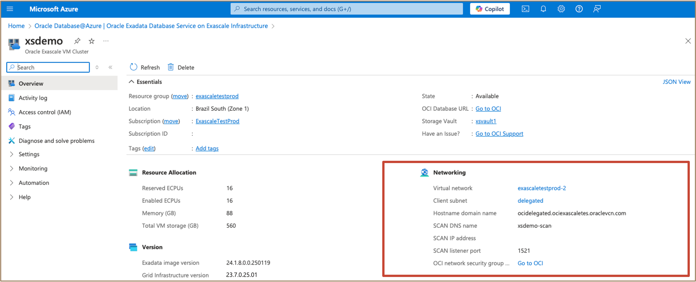   
        
## Task 3: Discover the Oracle Exascale Database Storage Vault Details    
        
1. In the Oracle Exascale VM Cluster **Overview** section, under the **Essentials**, click the name of the created **Storage Vault**.
   
   On the **Oracle Exascale DB Storage Vault** **Overview** page ***Discover the available Exascale DB Storage Vault information:***

    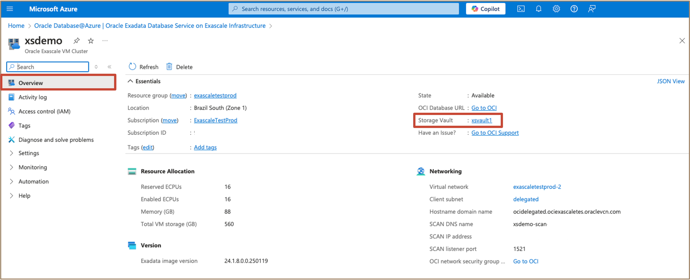

    * In the **Essentials** Section you can find the following key items:
        * What Resource group the Oracle Exascale DB Storage Vault is in.
        * The Location of the Oracle Exascale DB Storage Vault.
        * The Subscription where the Oracle Exascale DB Storage Vault is deployed.
        * The Subscription ID.
        * Assigned tags for the Oracle Exascale DB Storage Vault 
        * The State of the Oracle Exascale DB Storage Vault
        * A link to view the OCI Storage vault URL
    * In the **Exascale Database Storage** Section you will find the following key items:
        * The amount of Exascale database storage that was allocated and how much capacity is free.

    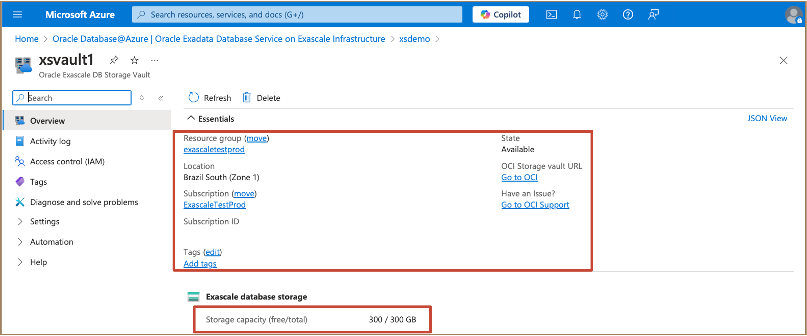
    
***!!! Congratulations:*** You may now **proceed to the next lab**. 

## Learn More

* Click [here](https://docs.oracle.com/en-us/iaas/exadb-xs/doc/manage-vm-clusters.html) to learn more about managing the VM clusters on the Exadata Database Service on Exascale Infrastructure.

## Acknowledgements

* **Author** - Leo Alvarado, Tammy Bednar, Product Management
  
* **Last Updated By** - Leo Alvarado, Product Management, April 2025.
