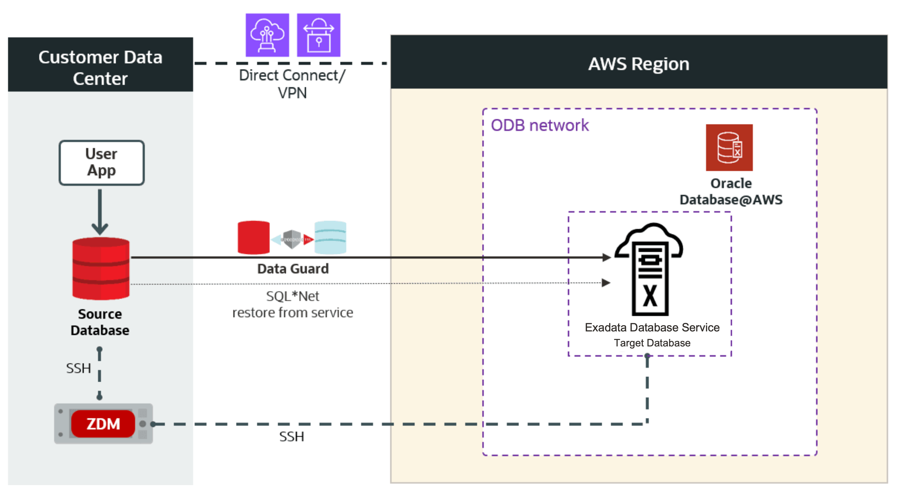

# Provision the Target Database on Oracle AI Database@AWS
## Introduction

> ***IMPORTANT — Pre-configured Environment - This lab will be presented as a guided demonstration in the session using a preconfigured Exadata Database Service on Exascale Infrastructure on Oracle AI Database@AWS environment.***
>

**Estimated time:** 10 minutes.

### Objectives

In this lab, you will:

- Provision an Oracle Database@AWS target database that will receive the migrated workload.

> ***IMPORTANT — Pre-configured Environment***
> 
> The Exadata Database Service on Exascale Infrastructure on Oracle AI Database@AWS environment used in this lab has been ***pre-configured for this session***. The configuration steps in the following tasks are provided for reference and will be discussed during the session. ***You do not need to perform these steps unless instructed.***

## Task 1: Review the Target Architecture

Figure 1. This is a High-Level Architectural overview showcasing the customer data center where the source database and ZDM’s server reside. It also shows all connectivity to the target Oracle Exadata Database Service on Oracle AI Database@AWS.

## Task 2: Provision Oracle Exadata Database Service on Exascale Infrastructure on Oracle AI Database@AWS

> ***This lab will be presented as a guided demonstration in the session using a preconfigured Exadata Database Service on Exascale Infrastructure on Oracle AI Database@AWS environment.***
>

## Acknowledgements

**Authors** 

* Leo Alvarado, Sebastian Solbach, Vishal Patil, Tammy Bednar, Product Management, Oracle Database Cloud Services, Multicloud 

**Last Updated Date** - August, 2026

