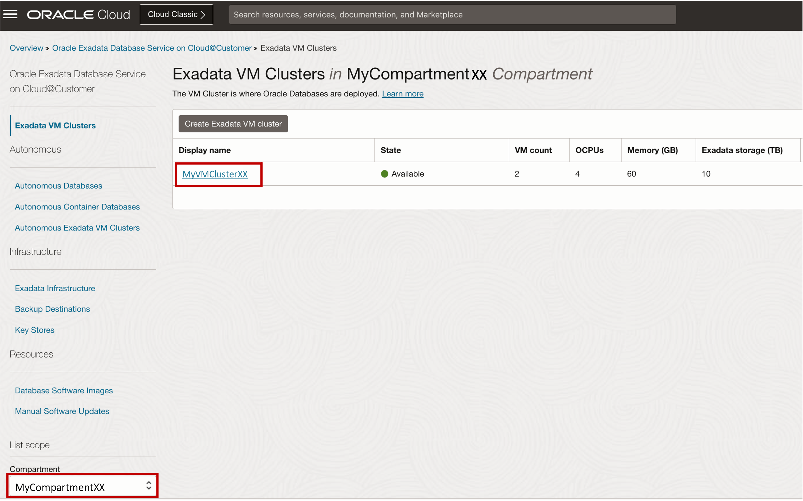

# Review and Connect to Oracle CloudWorld Lab Resources


## Introduction

This lab walks you through reviewing and connecting to the Oracle Cloud World lab environment.

Estimated Time: 15 minutes

<!-- Watch the video below for a quick walk-through of the lab.
[Create an Exadata Database Service on Cloud@Customer Infrastructure](youtube:DCrivNA5bs8)
-->
### Objectives

-   After completing this lab, you should be able to learn how to navigate, review and connect to the Oracle Cloud World lab environment.

### Prerequisites

This lab requires completion of the following:

* Login to **Oracle Cloud** using **OSC's tenancy** with your assigned workshop credentials


## Task 1: Discover and Connect to the Application Server (Oracle Cloud Developer Image)

1. Open the navigation menu. Under **Compute**, click **Instances**.
   
   

2. Under Compute, Click on **Instances** 
   
3. Select your assigned **Compartment**.
   
   From the list of Instances displays. Find the Compute named **MyAppServer**, and document the ***Private IP address*** for later use.

   
   

4. Open your local terminal and run the command to connect to the local OSC Bastion Server
   
      ```
        <copy>

        ssh -i ~/sshkey_student_xx.key -l {login name} ocw23oscbastion 

        </copy>
        ```
    
    >**Note:** Replace the **{login name}** with your assigned username login ***student_XX*** for the local OSC Bastion Server 

5. From the local OSC Bastion Server, Run the command to connect to the Application Server with SSH.
   
      ```
        <copy>

        ssh -i ~/sshkey_student_xx.key -l opc {App Server IP Address} 

        </copy>
        ```
    
    >**Note:** Replace the **{App Server IP Address}** with the ***Private IP address of the Application Server*** you obtained from *Step 3*

## Task 2: Discover and Connect to an Exadata Database Service Virtual Machine with SSH 

1. Open the navigation menu. Under **Oracle Database**, click **Exadata Database Service on Cloud@Customer**.
   
   

2. Select your assigned **Compartment**, and Click your assigned **VM Cluster** named ***MyVMClusterXX***.
   
   

    The VM Cluster Details page displays information about the selected VM cluster.

   


3. Under the **Resources** section on the left banner, click on **Virtual Machines**.

    The list of virtual machines displays. The **name**, **state**, and **client IP address** are displayed for each virtual machine in the VM cluster.

4. Find and document the **Client IP Address** of the first virtual machine for later use.

    

5. From the Application Server, Run the command to connect to the Exadata Database Service Virtual Machine with SSH.

      ```
              <copy>

              ssh -i ~/sshkey_student_xx.key -l opc {Exadata VM IP Address}

              </copy>
      ```
       
      >**Note:** Replace {Exadata VM IP Address} with the Exadata Database Service Virtual Machine IP Address obtained from *step 4*

## Task 3: Discover and Connect to the Oracle Database on Exadata Database Service with Oracle Sqldeveloper

1. From the Virtual Machines list page, Under the **Resources** section on the left banner, Click on **Databases**, then Click on the **Container Database** named **MyCDB01**. 

  

2. Under the **Resources** section on the left banner, Click on **Pluggable Databases**. Then Click on the **Pluggable Database** named **MyPDB**.

  

3. In the **Pluggable Databases section** of the page, Near the top, Click on the **PDB Connection** button.

  

4. This will render the **Pluggable Database Connection** Screen. **Click** the **Copy  Link** and paste the **Connection String** to your notepad or text editor.

  

1. From the Application Server, Open the terminal and Run ***sqldeveloper*** to launch Oracle SQL Developer.

      
                  

         [opc@myappserver ~]$ sqldeveloper

                  
        
   
  From the Oracle SQL Developer page provide the following information to connect to Oracle Database on Exadata Database Service.

  

      * Click **Create New Connection** Icon
      * Enter a **Name** for the Connection
      * For the **Database Type**, select **Oracle**
      * For the **Username**, enter **Sys**
      * Enter the Sys **password**
      * For the Role, select **SYSDBA**
      * For the **Hostname**, enter the **Hostname** *(from the PDB connection string - obtained from Step 4)*
      * For the **Port** enter **1521**
      * Enter the Database **Service Name**, enter the **Service Name** *(from the PDB connection string - obtained from Step 4)* 
      * **Test** & **Save** the connection
      * Click on **Connect**

  


You may now **proceed to the next lab**.

<!--
## Learn More

* Click [here](https://docs.oracle.com/en/engineered-systems/exadata-cloud-at-customer/ecccm/ecc-provisioning.html#GUID-4CB5B5E1-E853-4CA2-B43D-54CD18A8F28A) to learn more about Creating Infrastructure resource for Exadata Database Service on Cloud@Customer.

-->
## Acknowledgements

* **Author** - Leo Alvarado, Eddie Ambler, Product Management

* **Contributors** - Tammy Bednar, Product Management

* **Last Updated By** - Leo Alvarado, Product Management, July 2023.
