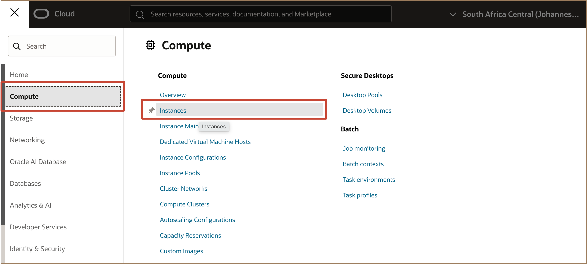
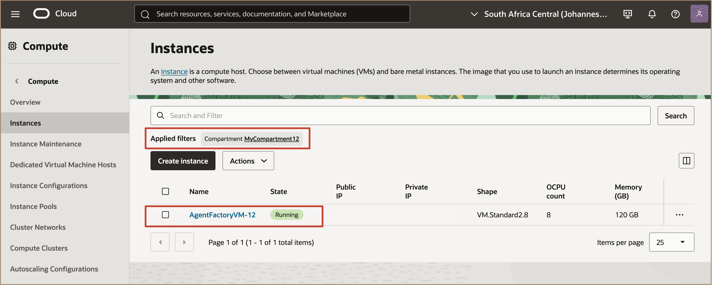
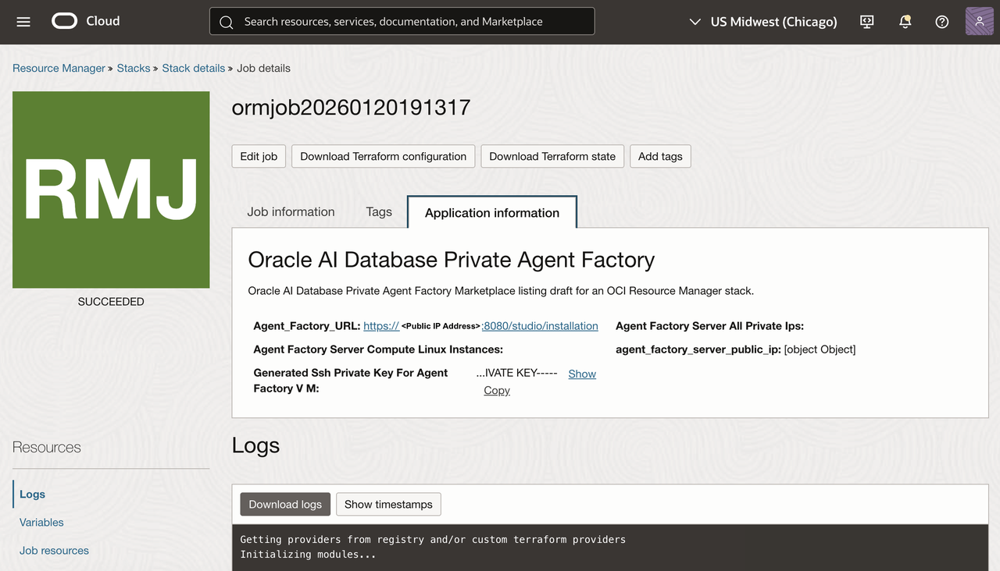
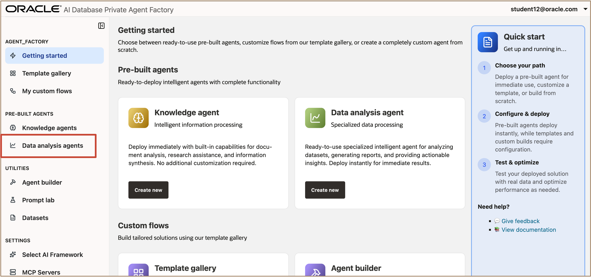
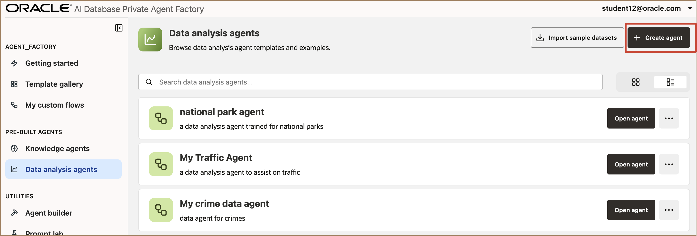
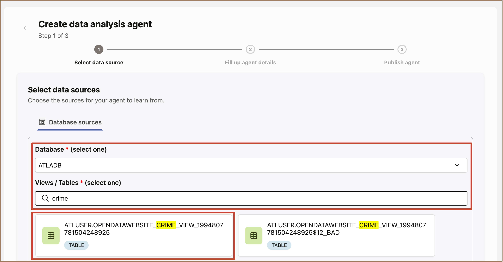
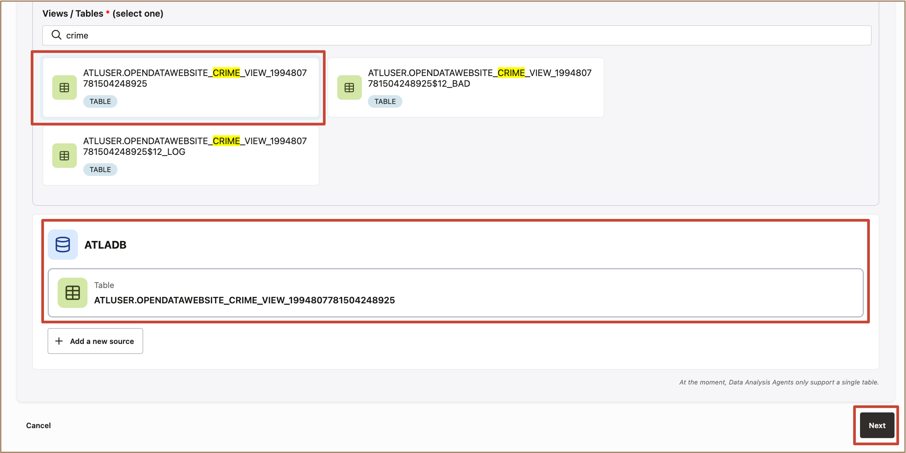
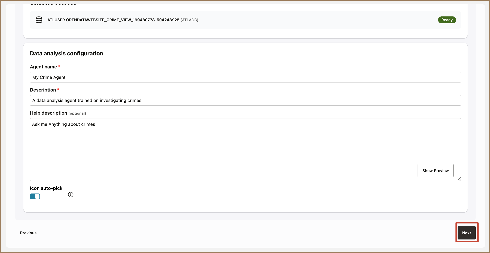

# Building Multicloud AI Agents on Oracle AI Database with Oracle AI Database Private Agent Factory
## Introduction
In this lab, you'll explore Oracle Agent Factory, a no-code platform built into Oracle AI Database that lets enterprises build, deploy, and manage AI agents grounded in their own private data. We'll cover how Agent Factory leverages AI Vector Search, MCP, and prebuilt agent templates to automate real-world workflows and extends seamlessly into multicloud deployments, using Oracle AI Database@Multicloud.

**Estimated time:** 60 minutes.

### Objectives

* Login and configure the Agent Factory
* Understand the Private Agent Factory Interface
* Configure Data Sources and Ground the Agent with Enterprise Data
* Create and talk to a Data Analysis Agent
* Set the Oracle AI Database and the LLM provider

### Prerequisites

* Your VCN and Oracle AI Database 26ai details from the previous lab
* Familiarity with the OCI Marketplace and Resource Manager


## Task 1: Launch and Open the Oracle Private Agent Factory.

1. In the OCI Console navigation menu, click on **Compute** then select **Instances**. 

   

2. In the **Applied filters**, select your assigned compartment **MyCompartmentXX**. Click on your assigned compute instance named **AgentFactoryVM-XX**.
   
   

3. Launch the Application URL
   
* Copy the public address and replace the **{instance-public-ip}** for the application URL, which has the format:

   ```
   <copy>
   https://{instance_public_ip}:8080/agentFactory/
   </copy>
   ```

   


## Task 2: Understand the Private Agent Factory Interface

***This task will be presented during the session.***

## Task 3: Configure Data Sources and Ground the Agent with Enterprise Data

***This task will be presented during the session.***

## Task 4: Create and talk to a Data Analysis Agent

1. In the AI Database Private Agent Factory page, under the **PRE-BUILT AGENTS** select **Data Analysis agents**.

   

2. In the **Data analysis agents** page, Click on **Create agent**. 
   
   

3. In the **Create data analysis agent** page Under the **Select data sources**, Select **ATLADB** search **crime** in the Views / Tables and Select on the ***ATLUSER.OPENDATAWEBSITE_CRIME_VIEW_1994807781504248925***.

   

4. Confirm the selected table and click on **Next**.

   

5. Fill in the **Agent Name**, **Description**, and **Help description**. Click on **Next**

   


You may now **proceed to the next lab**

## References

* Product documentation: [https://docs.oracle.com/en/database/oracle/agent-factory/](https://docs.oracle.com/en/database/oracle/agent-factory/)

## Acknowledgements

**Authors** 

* Leo Alvarado, Vishal Patil, Tammy Bednar, Product Management, Oracle Database Cloud Services, Multicloud 

**Last Updated Date** - April, 2026
