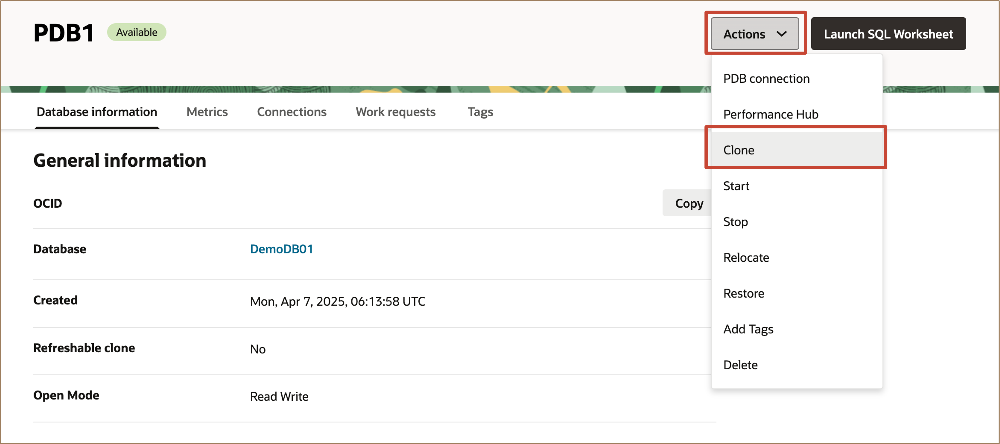
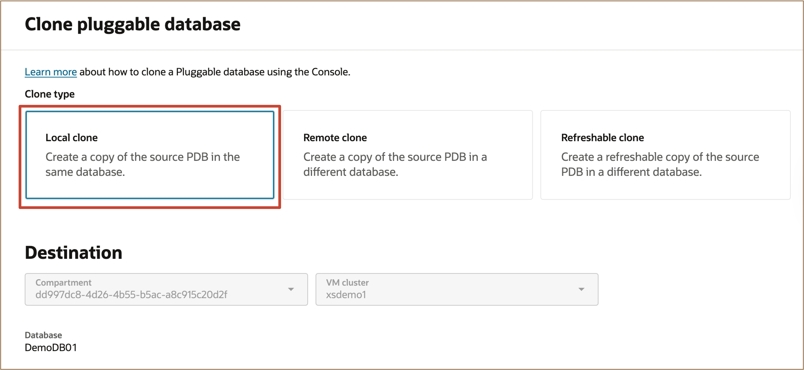
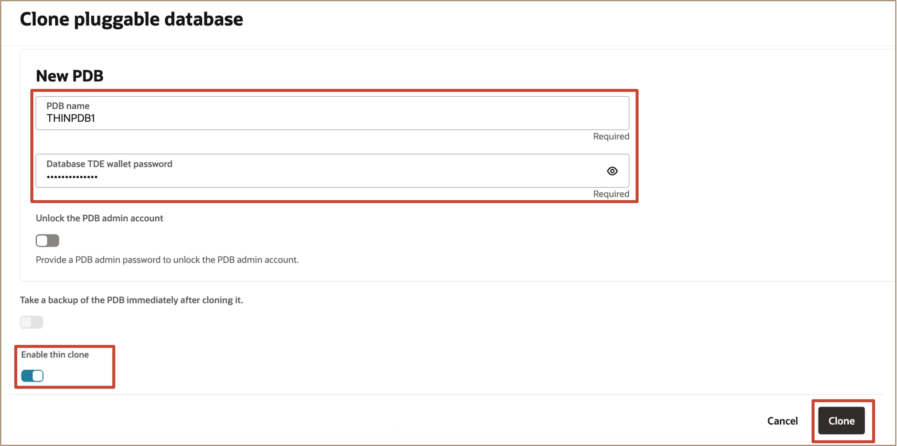
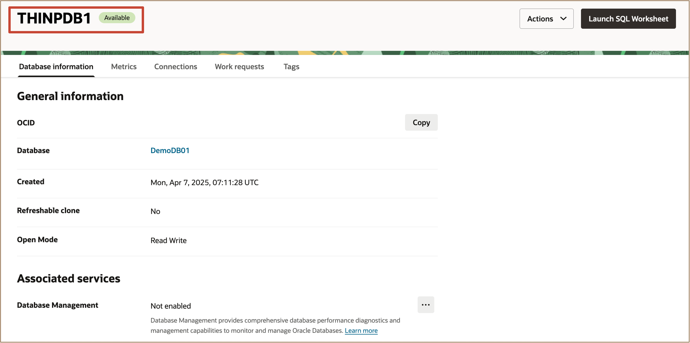
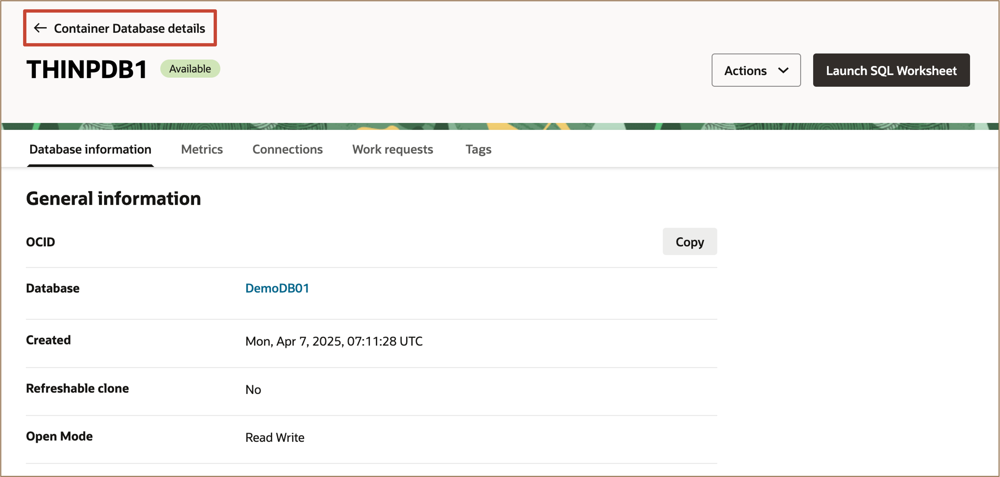
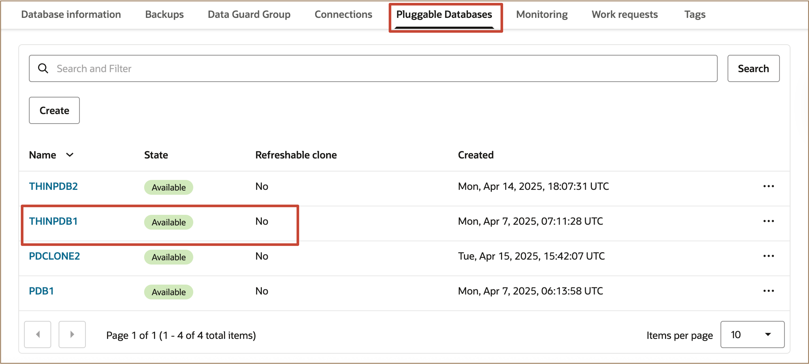

# Create Thin Clone of an Oracle Pluggable Database (PDB) 

## Introduction

This lab walks you through how to create thin clone of an Oracle Pluggable Database on the Exadata Database Service on Exascale Infrastructure using the OCI Console.
 

**Estimated Time:** ***10 minutes***

### **Objectives**

-   After completing this lab, you should be able to create thin clone of an Oracle Pluggable Database on the Exadata Database Service on Exascale Infrastructure on Oracle Database@Azure using the OCI Console. 

### **Prerequisites**

This lab requires the completion of the following:

* Successful creation of a VM Cluster on Exadata Database Service on Exascale Infrastructure.
* Successful creation of Container Database on the VM Cluster, which will also includes the initial PDB.
* Completion of **Lab 4**

## Task 1: Create Thin clone of a Pluggable Database

1. In the **Pluggable Database Details** page, click the **Actions** button and select **Clone** to initiate the **Clone PDB** action.

   > **Note:** This will cause the **Clone Pluggable Database** configuration page to be displayed.

2. Configure clone PDB options and select **Enable Thin Clone**.

   In the **Clone Pluggable Database** configuration page, select **Local Clone** as PDB clone type.

   Enter the information to configure the new PDB.

   * Enter **PDB Name**.
   * Enter **Database TDE wallet password**.

   Enable thin clone.
   * You can select **Take a backup of the PDB immediately after cloning**
   * ***Enable Thin Clone*** checkbox will be checked by default. Unchecking this box will create a thick clone instead of a thin clone of a pluggable database.
   * Click ***Clone*** to start the clone provisioning process.

   > **Note:** The thin PDB clone will be created and presented as a new PDB.
   

3. List all of the PDBs in the CDB. From the **Pluggable Database Details** page, click the back arrow to go back to the **Container Database Details** in the breadcrumb path.

   Click **Pluggable databases**.

   > **Note:** This will cause a list of available pluggable databases to be displayed and that the thin clone PDB is listed, as just another PDB.
    
    
***Congratulations!!!*** You may now **proceed to the next lab**. 

## Learn More

* Click [here](https://docs.public.oneportal.content.oci.oraclecloud.com/en-us/iaas/exadata/doc/ecc-create-first-db.html) to learn more about Creating an Oracle Pluggable Database on Exadata Database Service on Exascale Infrastructure.

## Acknowledgements

* **Author** - Leo Alvarado, Christian Craft  Product Management

* **Last Updated By** - Leo Alvarado, Product Management, Aug 2025.
