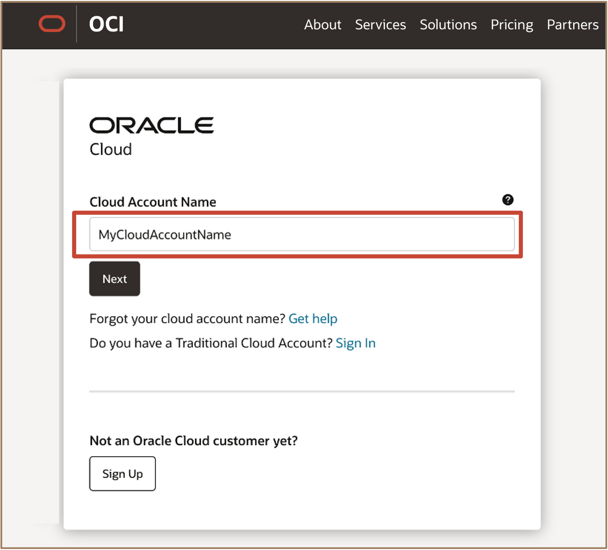
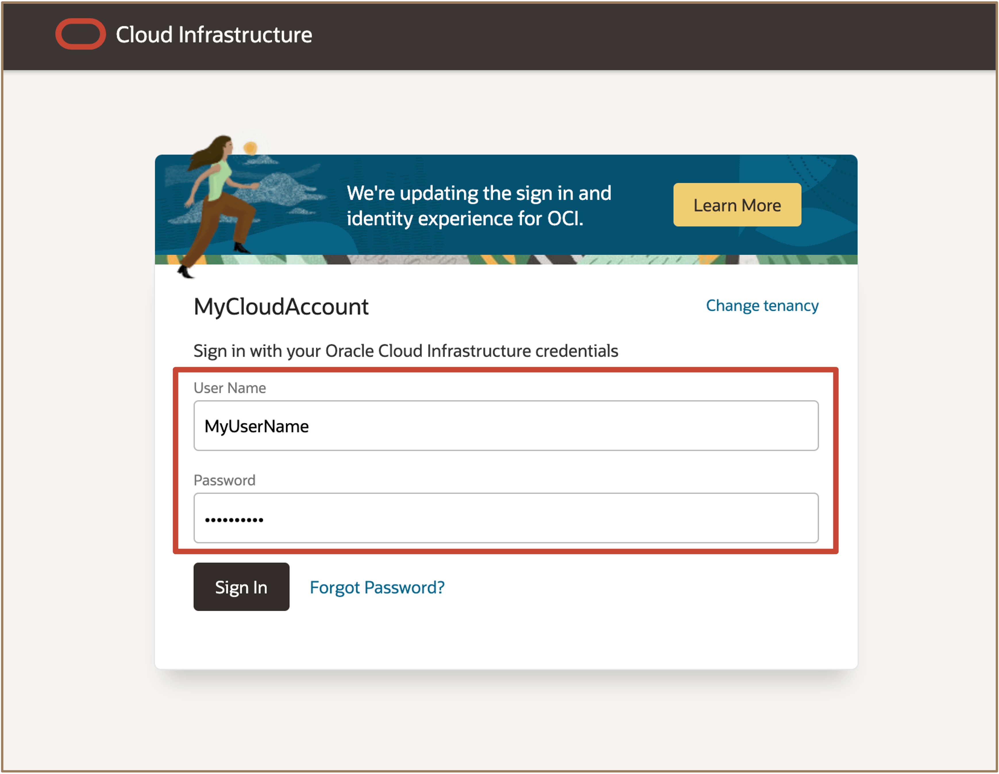
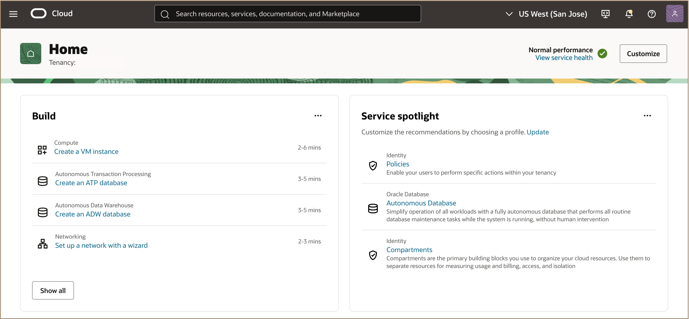

# Get started - Connect to Oracle Cloud Tenancy

## **Introduction**

Oracle Cloud is the industry's broadest and most integrated cloud provider, with deployment options ranging from the public cloud to your data center. Oracle Cloud offers best-in-class services across Software as a Service (SaaS), Platform as a Service (PaaS), Database as a Service (DBaaS), and Infrastructure as a Service (IaaS).

**Estimated Time:** ***10 minutes***

<u>**Types of Cloud Accounts that can be used for this workshop:**</u>

   * ***Oracle Cloud Paid Account***: When your tenancy is provisioned, Oracle sends an email to the default administrator at your company with the sign-in credentials and URL. This administrator can then create a user for each person who needs access to the Oracle Cloud. Check your email or contact your administrator for your credentials and account name.

   * ***Oracle provided Cloud Workshop Account***: This type of environment can be obtained by engaging with your Sales Engineer to coordinate obtaining approval to obtain an Event Code which will provide temporary access to an Oracle provided environment.

<!-- Watch the video below for a quick walk-through of the lab.
[Create Oracle Database](youtube:JJ4Wx0l0gkc)
-->
### **Objectives**

-   For this workshop we will learn how to login to a tenancy using the  **Oracle Cloud Paid Account**. 

### **Prerequisites**
  
- Oracle Cloud Infrastructure (OCI) Service Limits approved in the region you want to provision Oracle Exadata Database Service.

* **Cloud Account Name** - Secure your Oracle Cloud tenancy name that will be used for this workshop.

* **Username** - Secure your personal or assigned username for this workshop

* **Password** - Secure your personal or assigned password for this workshop

* **Required Service Limits** - If you are using a personal Oracle Cloud tenancy, you will need to ensure that you have service limits assigned for the following resources to run the workshop:    

   | Limits Name | Description | Value |
   |-------------|-------------|----------|
   | exadbxs-vm-instance-base-count|Exadata Database Service on Exascale Infrastructure - Instance Count| >= **2**|
   | exadbxs-total-cpu-base-count | Exadata Database Service on Exascale Infrastructure - Total ECPU Count | >= **32**  |
   | exadbxs-local-storage-base-gb     | Exadata Database Service on Exascale Infrastructure - Local Storage (GB)    | >= **600** GB  |
   | exadbxs-hc-storage-base-gb        | Exadata Database Service on Exascale Infrastructure - High Capacity Storage (GB) | >= **600** GB

* **Required IAM Policy for Oracle Exadata Database Service on Exascale Infrastructure** - Configure the [<u>**required Identity Access Management (IAM) Policy**</u>](https://docs.oracle.com/en-us/iaas/exadb-xs/doc/preparing-for-exadb-xs-deployment.html#GUID-EA03F7BC-7D8E-4177-AFF4-615F71C390CD) for provisioning Oracle Exadata Database Service on Exascale Infrastructure systems

## Task 1: Log in to Oracle Cloud Tenancy

1. Go to [<u>**cloud.oracle.com**</u>](https://cloud.oracle.com/?region=us-sanjose-1&tenant=livelabs4exadb) and enter your **Cloud Account Name** *(**Cloud Tenancy**)*. 

   

2. Enter your assigned **username** and **password** and click **Sign In** 

   

3. You are now signed in to Oracle Cloud! 
   
   

You may now **proceed to lab 1**.

## Acknowledgements

* **Author** - Leo Alvarado, Christian Craft  Product Management

* **Last Updated By** - Leo Alvarado, Product Management, Aug 2025.
