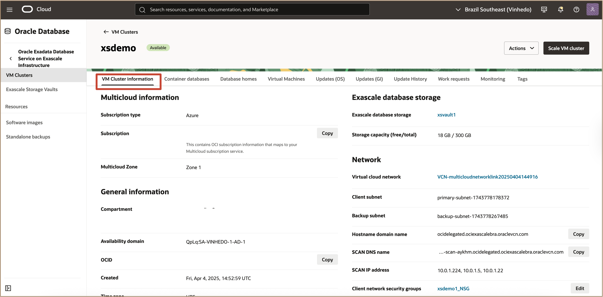
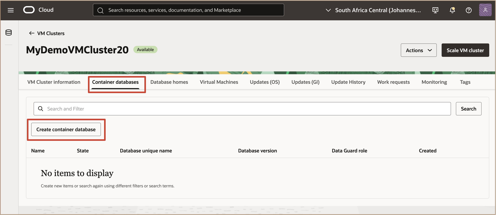
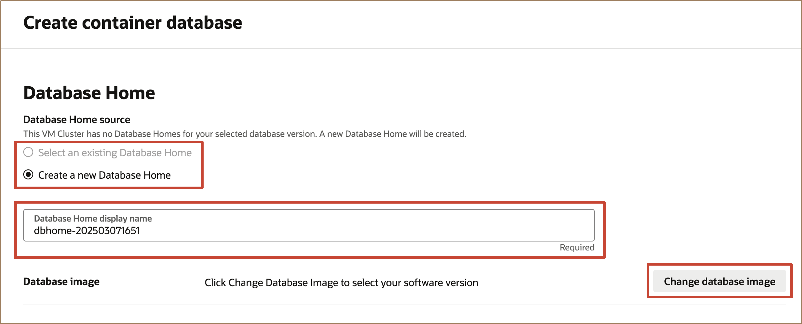
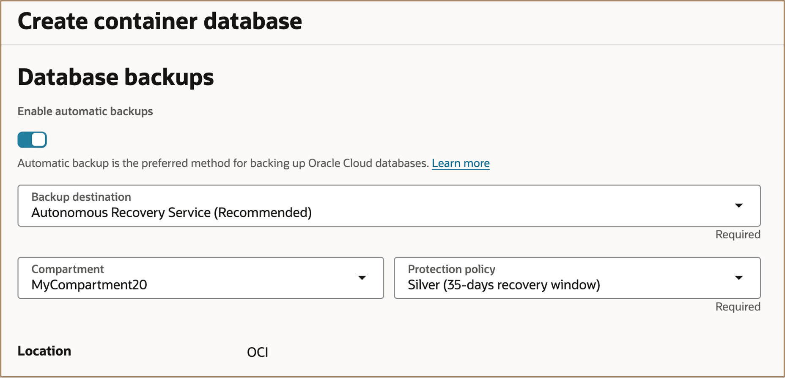
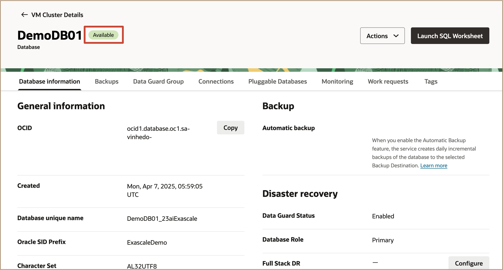
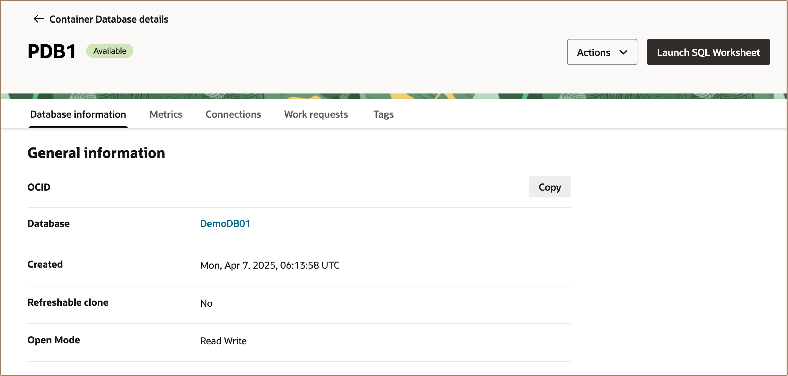

# Create Oracle Database on Oracle Exadata Database Service on Exascale Infrastructure

## Introduction

This lab walks you through how to create an Oracle Database on the Oracle Exadata Database Service on Exascale Infrastructure using the OCI Console. 
 

**Estimated Time:** ***10 minutes***

### Objectives

-   After completing this lab, you should be able to create an Oracle Database on Oracle Exadata Database Service on Exascale Infrastructure using the OCI Console.

### Prerequisites

* A provisioned Oracle Exadata Database Service on Exascale Infrastructure on Oracle Database@Azure Instance.

## Task 1: Provision an Oracle Database

1. Log in to the OCI Console and navigate to **VM Cluster Details**.

2. Select **Container databases** and click ***Create container database***.

3. In the **Create container database** page, enter the following information.
   
* **Basic information for container database:**
     * **Provide the database name:** Enter a name for the database.
     * **Provide a unique name for the database ***(Optional)***:** Enter a unique name for the database
     * **Select a database version:** Select the database version available.
     * **Provide a PDB name ***(Optional)***:** Enter the name of the first PDB to be created.

* **Specify a database Home:**
     * **Database Home source:** Select to use an ***existing Database Home*** or ***Create a new Database Home***.
     * **Database Home display name:** Use the default database home name or enter a database home name.
     * **Change Database Image ***(Optional)***:** Determines what Oracle Database version is used for the database. By default, the latest Oracle-published database software image is selected. Select to use an older Oracle-published image or a custom database software image that you have created in advance.

* **Create administrator credentials:**
     * **Password:** Password must be 9 to 30 characters and contain at least 2 uppercase, 2 lowercase, 2 special, and 2 numeric characters. The special characters must be `\`, `_`, `#`, or `-`.
     * **Confirm Password:** Enter the same password.

4. In the **Configure Database backups** page, if you accept the defaults setting, the database will be backed up using the Oracle Database Autonomous Recovery Service. You have the option to use OCI Object Storage by changing the **Backup destination**. The database will not be backed up if you deselect **Enable automatic backups**. Automatic backups can be enabled after the container database is created.

      
5. Click **Show advanced options** and enter the following information.

   -  **Management:** You can add **Oracle SID prefix (_Optional_)** and select the **Character set** and **National Character set**.

   - **Encryption:** Configure key management, you have options to manage database keys. Select **Use Oracle-managed keys** to manage database keys using the wallet or select **Use customer-managed keys** to manage database keys using OCI Vaults.

   - **Tags:** Apply free-form or defined tags to this resource.

6. Click **Create** to create the container database.

   Once the provisioning process of the container database is completed, the state of the container database will show as **Available**.

7.  In the **Database details** page, select the **Pluggable Databases** tab.

   Click **Pluggable Database** to view the details of the pluggable database.

***!!! Congratulations:*** You may now **proceed to the next lab**. 
 

## Learn More

* Click [here](https://docs.oracle.com/en-us/iaas/exadb-xs/index.html) to learn more about the Exadata Database Service on Exascale Infrastructure.

## Acknowledgements

* **Author** - Leo Alvarado, Bob Thome, Christian Craft, Seth Miller  Product Management

* **Last Updated By** - Leo Alvarado, Product Management, Aug 2025.
