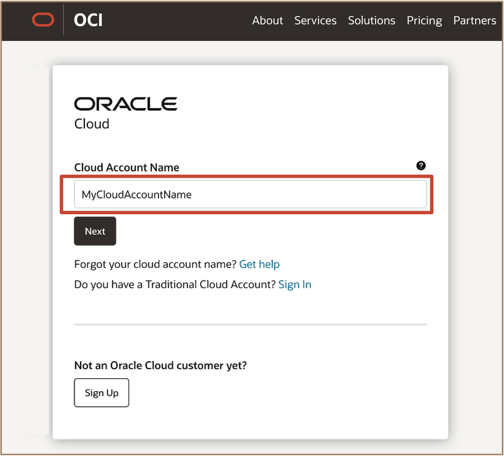
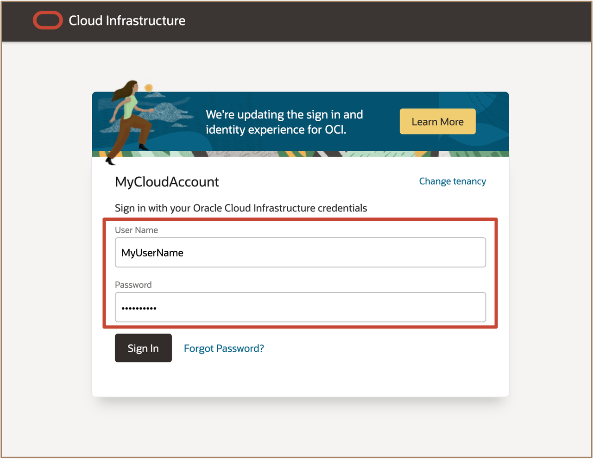
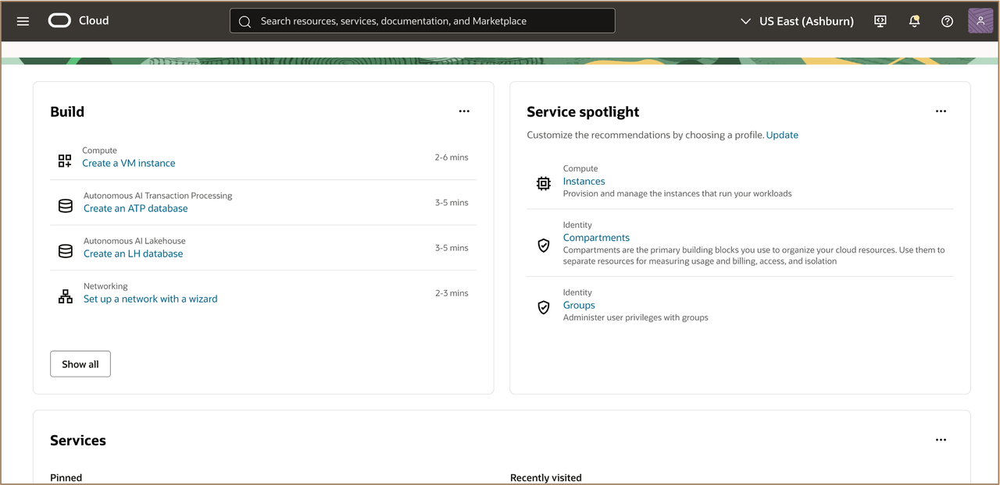

# Get started - Setting Up the Environment for Oracle Globally Distributed Exadata Database on Exascale Infrastructure

### Objectives

In this lab, you will:
* TODO: Add objectives


## **Introduction**

Oracle Cloud Infrastructure (OCI) provides a comprehensive, cloud-native platform for building and running modern applications, from core infrastructure to advanced database and AI services. With deployment options spanning public cloud, hybrid cloud, multicloud, and dedicated regions, OCI delivers consistent performance, security, and scalability across environments.

In this lab, you will prepare your OCI environment to deploy an Oracle Globally Distributed Exadata Database on Exascale Infrastructure. This setup forms the foundation for building a resilient, globally distributed database architecture.

You will go through the essential setup steps, including:

* Subscribing to and enabling required OCI regions
* Organizing resources using compartments for governance and isolation
* Defining identity and access management (IAM) policies for secure access control
* Configuring virtual cloud networks (VCNs), subnets, and connectivity
* Setting up required security configurations for distributed deployments

By the end of this lab, your OCI tenancy will be fully prepared to support the deployment of a globally distributed, Exascale-based database environment, enabling you to proceed with provisioning and configuration in the next labs.

**Estimated Time:** ***15 minutes***

<u>**Types of Cloud Accounts that can be used for this workshop:**</u>

   * ***Customer OCI Tenancy (Paid)***: When your tenancy is provisioned, the default administrator receives a welcome email with the sign-in URL and credentials. The administrator can then create users and assign access using Identity and Access Management (IAM).
    
    * Ensure your tenancy has access to the required regions and service limits
    * Contact your administrator if you need credentials or permissions

   * ***Oracle-Provided Workshop Environment***: This is a temporary OCI environment provided by Oracle for training and workshop purposes. Access is typically granted through an event or workshop code, coordinated by your Oracle Sales Engineer or event organizer.
    
    * Preconfigured environment with required permissions
    * No setup required
    * Time-limited access


<!-- Watch the video below for a quick walk-through of the lab.
[Create Oracle Database](youtube:JJ4Wx0l0gkc)
-->
### **Objectives**

-   In this workshop, you will learn how to sign in to a ***Customer OCI Tenancy*** and access the Oracle Cloud Infrastructure (OCI) Console. 


### **Prerequisites**

* **Cloud Account Name** - Secure your Oracle Cloud tenancy name that will be used for this workshop.

* **Username** - Secure your personal or assigned username for this workshop

* **Password** - Secure your personal or assigned password for this workshop

* **Required Service Limits** - If you are using a personal Oracle Cloud tenancy, you will need to ensure that you have service limits assigned for the following resources to run the workshop:    

   | Limits Name | Description | Value |
   |-------------|-------------|----------|
   | exadbxs-vm-instance-base-count|Exadata Database Service on Exascale Infrastructure - Instance Count (Number of VM Instances)| >= **4**|
   | exadbxs-total-cpu-base-count | Exadata Database Service on Exascale Infrastructure - Total ECPU Count | >= **64**  |
   | exadbxs-local-storage-base-gb     | Exadata Database Service on Exascale Infrastructure - Local Storage (GB)    | >= **2400** GB  |
   | exadbxs-hc-storage-base-gb        | Exadata Database Service on Exascale Infrastructure - High Capacity Storage (GB) | >= **2400** GB


* **Required IAM Policy for Oracle Exadata Database Service on Exascale Infrastructure** - Configure the [<u>**required Identity Access Management (IAM) Policy**</u>](https://docs.oracle.com/en-us/iaas/exadb-xs/doc/preparing-for-exadb-xs-deployment.html#GUID-EA03F7BC-7D8E-4177-AFF4-615F71C390CD) for provisioning Oracle Exadata Database Service on Exascale Infrastructure systems


## Introduction

TODO: Add introduction text here.

## Task 1: Log in to Oracle Cloud Tenancy

1. Go to [<u>**cloud.oracle.com**</u>](https://cloud.oracle.com/?region=us-sanjose-1&tenant=livelabs4exadb) and enter your **Cloud Account Name** *(**OCI Tenancy**)*. 

    


2. Enter your **username** and **password** and click **Sign In** 

    

3. You are now signed in to Oracle Cloud! 
   
   


## Task 2: Subscribe to Required Regions

**Objective**: Enable necessary regions in your OCI tenancy to support distributed database deployment.

1. Login to the **OCI Console** as a tenant administrator.
2. **Subscribe to ***Ashburn (IAD)*** region** (required for this service). [<u>**Follow this guide to subscribe to an Infrastructure Region**</u>](https://docs.oracle.com/en-us/iaas/Content/Identity/regions/To_subscribe_to_an_infrastructure_region.htm)
   
    > **Note:** Your Home Region does not have to be Ashburn, but subscription to Ashburn is mandatory to use Oracle's Globally Distributed Database services.

3. Subscribe to any additional regions (for example, Region 1, Region 2, etc.) where you plan to place databases for the catalog, shards, or Oracle Data Guard standby databases.

## Task 2: Create Compartments

**Objective**: Organize resources for clear administration and access control.

1. Create a parent compartment, e.g., `gdd`, for the distributed deployment.
2. Within the parent compartment, create the following child compartments:
    - `gdd_certs_vaults_keys` — for certificate authorities, certificates, certificate bundles, vaults, and keys.
    - `gdd_clusters` — for VM clusters, databases
    - `gdd_databases` — for VCNs, subnets, private endpoints.
    - `gdd_instances` — for application server compute instances (e.g., jump hosts for database access).
3. **Resulting hierarchy example**:
    ```
    tenant/
        gdd/
            gdd_certs_vaults_keys
            gdd_clusters
            gdd_databases
            gdd_instances
    ```

## Task 3: Define Access Control

**Objective**: Set up groups, dynamic groups, and IAM policies for secure resource management.

1. Create User Groups, Navigate to **Identity & Security > Groups** in the OCI console and create the groups below.

    | Group Name               | Description                                          |
    |--------------------------|------------------------------------------------------|
    | gdd-certificate-admins   | For certificate admins managing keys and vaults      |
    | gdd-infrastructure-admins| For infrastructure admins managing networking, Exadata, and distributed database resources |
    | gdd-users                | For users managing distributed database resources    |


2. Create Dynamic Groups

    | Dynamic Group Name   | Description                                  | Matching Rules (example)                                      |
    |----------------------|----------------------------------------------|---------------------------------------------------------------|
    | gdd-cas-dg           | For certificate authority resources          | `resource.type='certificateauthority'`<br/>`resource.compartment.id = 'OCID of compartment tenant root / gdd / gdd_certs_vaults_keys'`|
    | gdd-clusters-dg      | For Exadata VM cluster resources             | `resource.compartment.id = 'OCID of compartment tenant root / gdd / gdd_clusters'`|
    | gdd-instances-dg     | For compute instance resources               | `resource.compartment.id = 'OCID of compartment tenant root / gdd / gdd_instances'`|

    Create these under **Identity & Security > Dynamic Groups**.

3. Define IAM Policies

Create policies to assign least privilege access to the defined groups and dynamic groups. Policy examples are given in the [Appendix](#appendix-sample-iam-policy-statements).

## Task 4: Configure Network Resources

**Objective**: Prepare networking to allow private, secure, and scalable communication paths for the distributed database topology.

1. **In Ashburn (IAD), create:**
    - A VCN named `gdd_iad`
    - A regional subnet named `gdd_subnet` within `gdd_iad`
    - Assign both to the `gdd/gdd_databases` compartment

2. **Create a private endpoint** in Ashburn (IAD) region
    - Name: `gdd_pe`
    - Subnet: `gdd_subnet`
    - VCN: `gdd_iad`
    - Compartment: `gdd/gdd_databases`

3. **(For each additional region where a database is placed):**
    - Create a VCN, subnet, and service gateway (e.g., `gdd_R1` with `osd-database-subnet-R1` and `gdd_sgw_R1`)
    - Peer required VCNs, for instance:
        - `gdd_iad` ⇔ `gdd_R1`
        - `gdd_R1` ⇔ `gdd_R2`, etc.
    - Ensure **unrestricted, bi-directional connectivity** between relevant subnets.

4. **See OCI documentation for:**
    - [Creating VCNs and Subnets](https://docs.oracle.com/en-us/iaas/Content/Network/Tasks/VCNs.htm)
    - [Setting up Service Gateways](https://docs.oracle.com/en-us/iaas/Content/Network/Tasks/servicegateway.htm#Access_to_Oracle_Services_Service_Gateway)
    - [VCN Peering through a DRG (Dynamic Routing Gateway)](https://docs.oracle.com/en-us/iaas/Content/Network/Tasks/VCNpeering.htm)

## Task 5: Configure Security Resources

**Objective**: Create vaults and keys to manage encryption and security.

1. **In the `gdd/gdd_certs_vaults_keys` compartment:**
    - Create a **vault** for Transparent Data Encryption (TDE) master encryption keys.
    - For multi-region topologies, create a vault in each region where shards will reside (e.g., `gdd_vault_R1`).

2. **Create a TDE master encryption key** in each vault:
    - Example settings:
        - Protection Mode: Software
        - Algorithm: AES
        - Length: 256 bits

## Task 6: Create Exadata Resources

**Objective**: Deploy Exadata VM clusters per catalog or shard in the topology.

1. **Import the `Oracle-ApplicationName` tag namespace:**
    - Go to **Governance & Administration > Tag Namespaces**
    - Ensure `Oracle-ApplicationName` exists in the root compartment; if not, import it.

2. **Create Exadata VM Clusters:**
    - Create **one VM cluster per database** (catalog or shard is recommended).
    - Only single-node clusters are supported.
    - Enable 8 ECPUs per VM cluster intended for shards.
    - Each database requires at least **500 GB storage**; sum requirements for all databases.
    - Use the imported tag:  
      `Oracle-ApplicationName.Other_Oracle_Application: Sharding`
    - Set the same time zone for all clusters.

***Please follow Lab 1, Task 1 for the step-by-step guide to provision the Exadata Database Service on an Exascale instance.***

## Appendix: Sample IAM Policy Statements

Sample policy statements for the groups/dynamic groups (customize as needed):

```text
# gdd-certificate-admins (Tenant-level)
Allow group 'Default' / 'gdd-certificate-admins' to INSPECT tenancies in tenancy
Allow group 'Default' / 'gdd-certificate-admins' to INSPECT work-requests in tenancy

# gdd-infrastructure-admins (Tenant-level)
Allow group 'Default' / 'gdd-infrastructure-admins' to INSPECT tenancies in tenancy
Allow group 'Default' / 'gdd-infrastructure-admins' to INSPECT work-requests in tenancy
Allow group 'Default' / 'gdd-infrastructure-admins' to READ limits in tenancy
Allow group 'Default' / 'gdd-infrastructure-admins' to READ tag-namespaces in tenancy

# gdd-users (Tenant-level)
Allow group 'Default' / 'gdd-users' to INSPECT tenancies in tenancy
Allow group 'Default' / 'gdd-users' to INSPECT work-requests in tenancy
Allow group 'Default' / 'gdd-users' to READ limits in tenancy
Allow group 'Default' / 'gdd-users' to READ Distributed-database in tenancy
Allow group 'Default' / 'gdd-users' to READ tag-namespaces in tenancy

# gdd-certificate-admins (Compartment-level)
Allow group 'Default' / 'gdd-certificate-admins' to MANAGE keys in compartment gdd
Allow group 'Default' / 'gdd-certificate-admins' to MANAGE vaults in compartment gdd

# gdd-infrastructure-admins (Compartment-level)
Allow group 'Default' / 'gdd-infrastructure-admins' to MANAGE exadb-vm-clusters in compartment gdd
Allow group 'Default' / 'gdd-infrastructure-admins' to MANAGE instance-family in compartment gdd
Allow group 'Default' / 'gdd-infrastructure-admins' to MANAGE Distributed-database in compartment gdd
Allow group 'Default' / 'gdd-infrastructure-admins' to MANAGE tags in compartment gdd
Allow group 'Default' / 'gdd-infrastructure-admins' to MANAGE virtual-network-family in compartment gdd
Allow group 'Default' / 'gdd-infrastructure-admins' to READ exascale-db-storage-vaults in compartment gdd
Allow group 'Default' / 'gdd-infrastructure-admins' to READ distributed-database-workrequest in compartment gdd

# gdd-users (Compartment-level)
Allow group 'Default' / 'gdd-users' to READ Distributed-database in tenancy
Allow group 'Default' / 'gdd-users' to INSPECT work-requests in tenancy
Allow group 'Default' / 'gdd-users' to READ limits in tenancy
Allow group 'Default' / 'gdd-users' to READ tag-namespaces in tenancy

```

You may now **proceed to lab 1**.


## Acknowledgements

* **Author** - Leo Alvarado, Deeksha Shrivastava, Product Management

* **Last Updated By** - Leo Alvarado, Product Management, Mar 2026.
