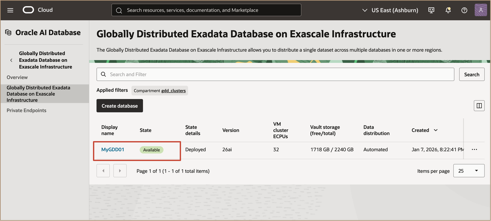
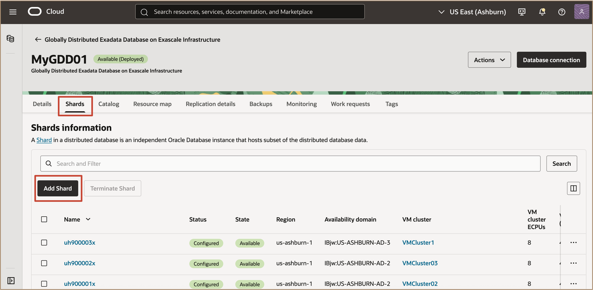
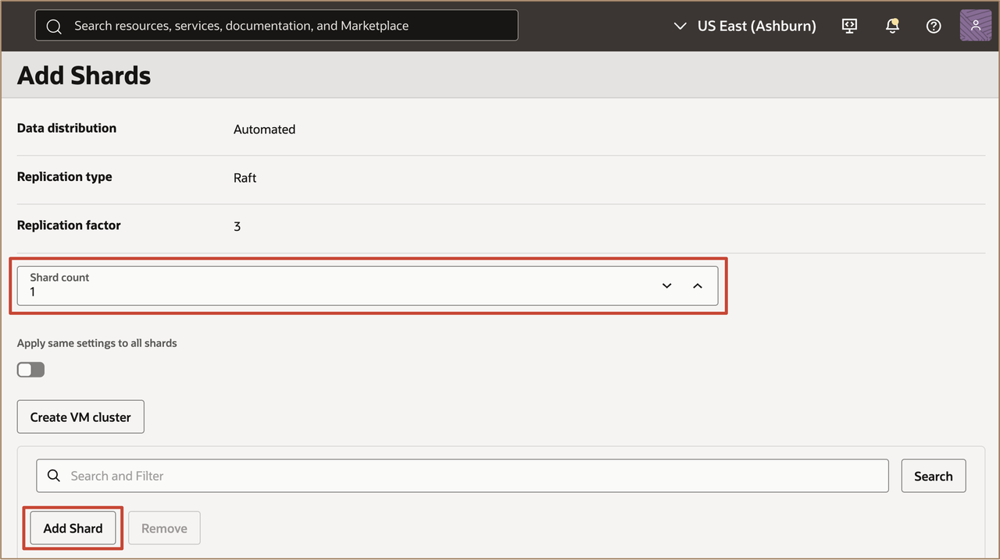
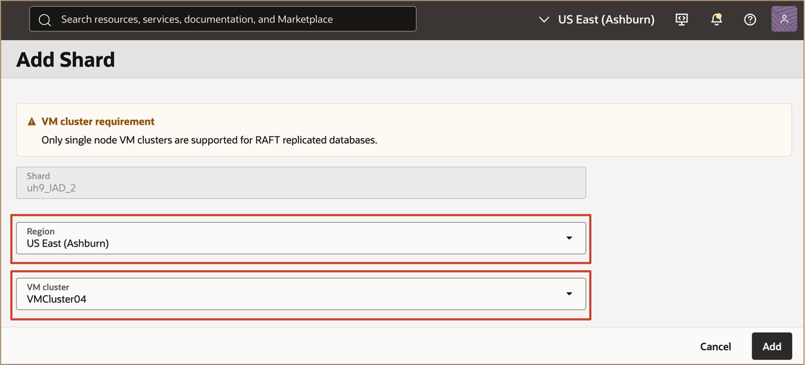
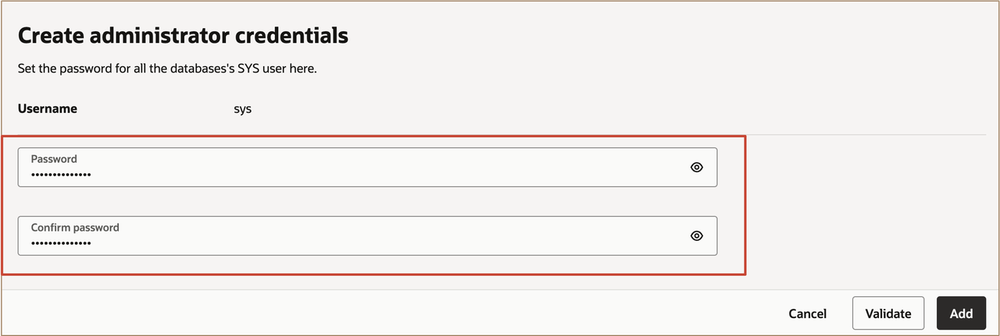
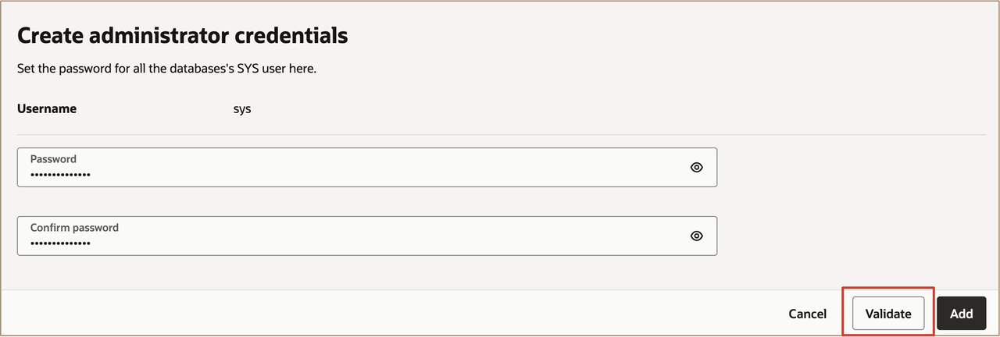
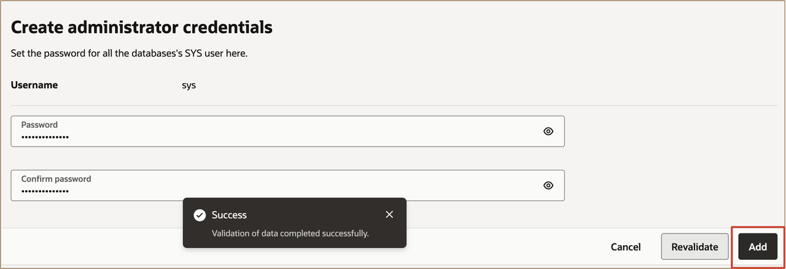
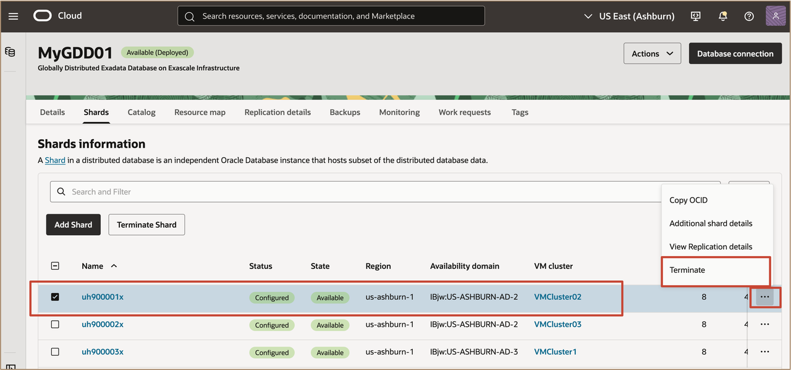
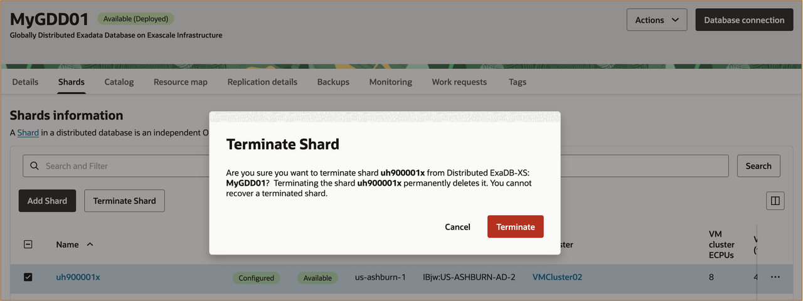

# Managing Oracle Globally Distributed Exadata Database on Exascale Infrastructure

## Introduction

This lab walks you through how to Manage Oracle Globally Distributed Exadata Database on Exascale Infrastructure.
 
  

**Estimated Time:** ***10 minutes***

### **Objectives**

-   After completing this lab, you should be able to manage a globally distributed database by adding new shards to scale out your deployment and terminating existing shards when they are no longer needed, enabling you to perform basic lifecycle management operations within the OCI Console. 

### **Prerequisites**

This lab requires the completion of the following:

* Successful creation of a VM Cluster on Exadata Database Service on Exascale Infrastructure.

## Task 1: Adding Shards to a Globally Distributed Exadata Database on Exascale Infrastructure

This lab demonstrates how to add new shards to scale out your **Globally Distributed Exadata Database on Exascale Infrastructure**. Adding shards allows you to increase capacity and improve performance by horizontally expanding the database across additional resources.

When to Add Shards

You can add shards in the following scenarios:

* After creating a Distributed Exadata Database Service on Exascale Infrastructure resource, but before deploying it.
* After the Distributed Exadata Database Service on Exascale Infrastructure has been deployed, when additional scale or performance is required.

1. In the Oracle Cloud Console, go to the **Globally Distributed Exadata Database on Exascale Infrastructure** list page.
   
   Select the Distributed Exadata Database Service on Exascale Infrastructure Instance to which you intend to add shards.

   

2. On the resource's detail page, under **Shards**, click **Add Shard**.
   
   

   **Configure the New Shard(s)**

    - In the **Add shard** panel, configure each new shard with the following settings:

        - **Shard count**: Specify the number of shards to add (up to 10 per set; further shards can be added after deployment if needed).
        
        

        Click on **Add Shard**

        - **Shard**: Review the display name for each shard or shardspace. The name is populated once you pick a region.
        - **Region**: Select the target region for the new shard.
        - **VM cluster**: Choose a VM cluster available in the selected region.
        > **Note:** It is recommended to use one VM cluster per database (shard or catalog).
        
        

3. **Set Administrator Credentials**: In **Create administrator credentials**, set the password for the ADMIN user of the new shard database.

    

4. Click **Validate** to run system checks and ensure all new shard settings are correct.

    

5. When validation passes, click **Add Shards** to deploy the new shards to your Distributed ExaDB-XS.

    

> **Notes**
> - If you are *scaling up* a **deployed** Distributed Exadata Database Service on Exascale Infrastructure, you must deploy the new shards within ***7 days*** of completing this procedure. If not, you will receive an error and must terminate the new shard resources and start again.
> - If you are *adding shards* to an **undeployed** Distributed Exadata Database Service on Exascale Infrastructure, you also have ***7 days*** from completing the original resource creation to add any shards and complete deployment. After 7 days, you must terminate and re-create resources.

## Task 2: Terminate (Deleting) a Shard

Terminating a shard in a Globally Distributed Exadata Database on Exascale Infrastructure configuration permanently deletes it and removes all automatic backups.

1. On the Globally Distributed Exadata Database on Exascale Infrastructure list page, select a Distributed Exadata Database Service on Exascale Infrastructure.
   
2. On the Details page, in the **Shards** tab, select the shard, and then select **Terminate** from the action menu.

    
   
3. On the Terminate shard dialog, click **Terminate** to confirm that you want to remove the shard.

    

> **Note** You cannot recover a terminated shard.
   

## Learn More

* Click [here](https://docs.public.oneportal.content.oci.oraclecloud.com/en-us/iaas/exadata/doc/ecc-create-first-db.html) to learn more about Creating an Oracle Pluggable Database on Exadata Database Service on Exascale Infrastructure.

## Acknowledgements

* **Author** - Leo Alvarado, Deeksha Shrivastava, Product Management

* **Last Updated By** - Leo Alvarado, Product Management, Mar 2026.
